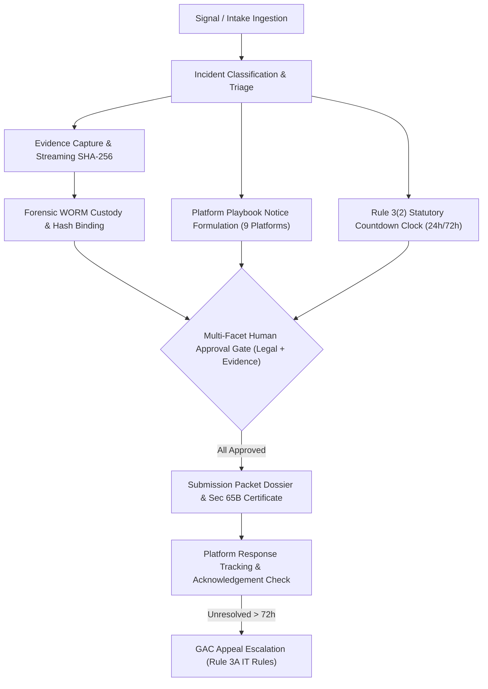
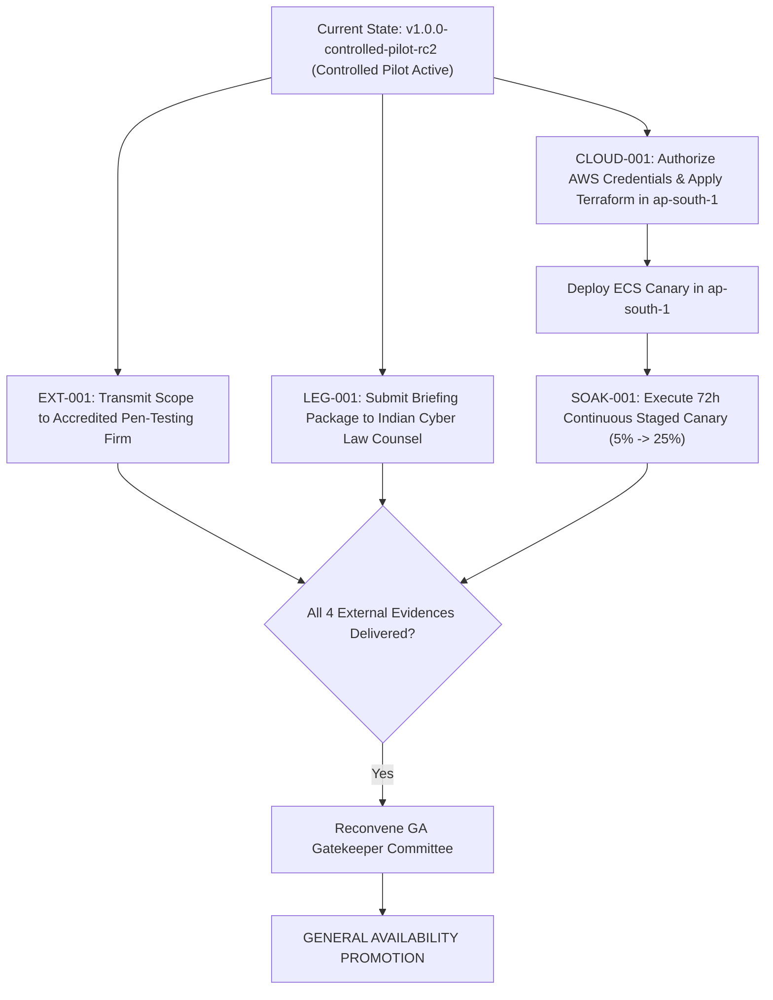

# Digital Impersonation Response Desk

> **India-first B2B incident-response platform for digital impersonation and synthetic-media (deepfake) incidents.**  
> *Evidence Custody → Threat Triage → Multi-Role Human Review → Statutory Notice Preparation → SLA Tracking → GAC Escalation*

[](https://github.com/ChiragArora22/DeepFake/actions/workflows/ci.yml)
[](tests/)
[](tsconfig.json)
[](package.json)
[](LICENSE)
[](docs/assurance/current-status.md)
[](docs/assurance/current-status.md)

---

## ⚡ What This Is

The **Digital Impersonation Response Desk** is an enterprise-grade SaaS system engineered to detect, preserve evidence of, classify, and formulate formal statutory takedown notices for online impersonation campaigns, executive deepfakes, fraudulent brand accounts, and synthetic media scams.

It is built specifically around the legal and regulatory architecture of the **Republic of India**—integrating the **Information Technology Act, 2000 (IT Act)**, the **Information Technology (Intermediary Guidelines and Digital Media Ethics Code) Rules, 2021 (IT Rules 2021)**, the **Digital Personal Data Protection Act, 2023 (DPDP)**, and **Section 65B of the Indian Evidence Act / Section 63 of Bharatiya Sakshya Adhiniyam, 2023**.

---

## 🚨 Why It Exists

The rapid weaponization of generative AI has fundamentally altered brand protection and cybersecurity:
* **Hyper-Realistic Impersonation:** Scammers deploy voice clones and video deepfakes of corporate executives, physicians, and founders within hours to direct fraudulent payments, market counterfeit pharmaceuticals, or harvest credentials.
* **The Evidence Crisis:** Traditional screenshots are easily dismissed in legal proceedings due to missing metadata, lack of hash verification, and broken chains of custody.
* **The 72-Hour Statutory Window:** Under **Rule 3(2)(b) of the IT Rules 2021**, major social media intermediaries must act on impersonation and deepfake grievances within **72 hours**. Most corporate legal teams fail to mobilize evidence and formulate compliant notices before this window lapses.
* **The Autonomous Trap:** Blindly automating takedowns creates catastrophic legal risks: automated false-positive takedowns trigger defamation lawsuits and tortious interference liability.

The Response Desk solves this by serving as an **intelligence and forensic acceleration platform for human incident responders**, enforcing cryptographic custody and strict human-in-the-loop governance.

---

## 🛠️ The Engineering Problem

Engineering an enterprise platform for digital impersonation response requires solving several conflicting challenges:
1. **Forensic Immutability vs. Data Privacy:** How to reconcile mandatory 180-day forensic evidence preservation under IT Rules Rule 3(1)(h) with a Data Principal's Right to Erasure under DPDP Section 12(3).
2. **Streaming Ingestion vs. Memory Sandboxing:** Ingesting large evidence files (up to 50 MB) while computing streaming cryptographic hashes in $O(1)$ memory without buffering full payloads into RAM.
3. **Multi-Tenancy vs. BOLA / IDOR:** Preventing cross-tenant data leaks across confidential corporate investigations at the database query layer rather than relying on error-prone route middleware alone.
4. **Third-Party Integration Safety:** Integrating with external platform APIs (YouTube, Meta, X) while maintaining an absolute guarantee of zero unauthorized account mutations.
5. **Assurance Discipline:** Verifying release candidates through explicit dependency graphs and deterministic gates, rather than relying on superficial local tests or fabricated readiness claims.

---

## 🏛️ System Architecture

The application is built as a **modular monolith** in TypeScript on Node.js 22 LTS, backed by SQLite 3 (`better-sqlite3`) in Write-Ahead Logging (`wal`) mode with foreign key enforcement and an AWS S3 WORM evidence vault (`ap-south-1`).

```mermaid
graph TD
    subgraph Client Tier
        UI["Web Single Page Application (Tailwind CSS / Semantic HTML)"]
    end

    subgraph Security & API Gateway
        SecHeaders["Security Headers (Helmet / CSP / CORS)"]
        RateLimiter["Sliding Window Rate Limiter"]
        AuthMiddleware["HMAC Bearer Token Auth & RBAC"]
        TenantGuard["Multi-Tenant Isolation Guard (WHERE org_id = ?)"]
    end

    subgraph Core Domain Monolith
        Router["Express Router (21 Modular Route Controllers)"]
        Services["Domain Services (Triage, Playbooks, Evidence, Approvals)"]
        StateMachines["Finite State Machines (Case, Evidence, Submission)"]
        Workers["Background Worker Pool (8 Persistent Workers with Leases)"]
    end

    subgraph Persistence & Forensic Storage
        SQLite[("Primary Relational DB (WAL Mode / 36 Tables)")]
        AuditLedger[("Immutable Append-Only Audit Ledger")]
        LocalWORM[("Local Staging Storage (HMAC Token Gated)")]
        AWSS3[("AWS S3 Evidence Vault (COMPLIANCE Mode WORM in ap-south-1)")]
    end

    subgraph External Platforms (Strictly Controlled)
        KillSwitch{"Emergency Kill Switch (Active Guard)"}
        OutboundGuard{"ENABLE_LIVE_PLATFORM_ACTIONS = false"}
        YouTubeAPI["YouTube Data API (Strict youtube.readonly Scope)"]
        WebSub["Inbound WebSub Webhooks (HMAC-SHA256 Verified)"]
    end

    UI --> SecHeaders --> RateLimiter --> AuthMiddleware --> TenantGuard --> Router
    Router --> Services
    Services --> StateMachines
    Services --> SQLite
    Services --> AuditLedger
    Services --> LocalWORM
    Services -.-> AWSS3
    Workers --> SQLite
    Services --> KillSwitch --> OutboundGuard --> YouTubeAPI
    WebSub --> KillSwitch
```

---

## 🔄 Core Operational Workflow

Every incident progresses through a formal, audited lifecycle:



---

## 🔬 Graph Engineering Approach

Rather than forcing complex release verification and statutory workflows into sequential shell scripts or unconstrained loops, this project was engineered using **Directed Acyclic Graph (DAG) Engineering**:

```mermaid
graph TD
    subgraph Plan
        PlanNode["PLAN: Baseline Reconciliation & Dependency Scoping"]
    end

    subgraph Fan-Out (Parallel Independent Specialists)
        PlanNode --> Sec["Security Audit & Adversarial QA (11 Attack Vectors)"]
        PlanNode --> Cloud["Cloud Infrastructure IaC Audit (ap-south-1 WORM)"]
        PlanNode --> SRE["Reliability & Canary Protocol (72h Soak Design)"]
        PlanNode --> Legal["Indian Legal Counsel Package (5 Statutory Inquiries)"]
        PlanNode --> Operator["Browser CDP & Operator UAT (24 Golden Steps)"]
    end

    subgraph Fan-In & Reduce
        Sec --> Reducer["REDUCE: Central Evidence Indexer & Findings Reducer"]
        Cloud --> Reducer
        SRE --> Reducer
        Legal --> Reducer
        Operator --> Reducer
    end

    subgraph Verify & Gate
        Reducer --> Verifier["INDEPENDENT VERIFIER: Fresh-Context Adversarial Disproval"]
        Verifier --> Gate{"DETERMINISTIC GA GATE: 17 Mandatory Criteria"}
        Gate --> Outcome["STATUS DETERMINATION: GA Strictly Withheld"]
    end
```

### Why Graph Engineering Matters
* **Parallel Fan-Out:** Independent specialist tracks (cloud provisioning, legal review, pen-test preparation) run concurrently without artificial blocking.
* **Failure Containment:** An open external dependency (such as pending AWS credentials) contains its blast radius to that specific branch without breaking internal test runs.
* **Independent Disproval:** A separate verification node actively attempts to *disprove* the success claims of prior nodes before any release gate evaluates.
* **No Fabricated Evidence:** If an external edge requires third-party physical action (an accredited pen-test report or physical elapsed canary time), the node halts at `OPEN / BLOCKED`. It is never synthetically simulated.

---

## 🔒 Security Architecture & STRIDE Defenses

The system implements comprehensive defenses verified against a 19-vector STRIDE threat model:

* **Authentication Hardening (`src/middleware/auth.ts`):** Stateless HMAC-SHA256 Bearer session tokens with constant-time verification (`crypto.timingSafeEqual`). Header-based authentication (`x-user-id`) is strictly rejected in production.
* **Multi-Tenant Scoping (Anti-BOLA/IDOR):** Every SQL query reading or writing tenant records includes explicit `WHERE organization_id = ?` parameterization. Cross-tenant queries return `HTTP 404 Not Found` to deny existence enumeration.
* **Input Validation & SSRF Firewall:** URLs submitted for monitoring pass through strict SSRF sanitization (`src/services/monitoring/url-normalization-service.ts`) blocking loopback (`127.0.0.1`), link-local (`169.254.169.254`), and private RFC 1918 subnets.
* **Fail-Closed Secrets (`src/config/env.ts`):** In `NODE_ENV=production`, the application refuses to boot if secrets are weak (< 32 characters) or contain development prefixes (`dev_`, `test_`).
* **Adversarial Red-Team Verification:** Rejection of **11 / 11 adversarial exploit vectors** verified in `tests/security/independent-verification.test.ts`.

---

## 📦 Evidence Custody & WORM Storage

Digital evidence is protected through an auditable, court-ready forensic pipeline:
* **Streaming SHA-256:** Computed in memory chunks directly on the incoming byte stream ($O(1)$ memory bound).
* **Magic-Byte MIME Validation:** Header inspection verifies legitimate media (`JPEG`, `PNG`, `MP4`, `PDF`) and rejects disguised executables.
* **Opaque Storage Keys:** Renamed to random UUID v4 identifiers (`ev_<uuid>.bin`) outside the web root, eliminating path traversal.
* **Time-Limited HMAC Download Tokens:** Direct public downloads are blocked. Authenticated operators receive 300-second HMAC-SHA256 signed download tokens.
* **180-Day WORM Compliance:** S3 Object Lock configured in `COMPLIANCE` mode enforcing minimum 180-day retention lock per Rule 3(1)(h) of the IT Rules 2021.
* **Legal Holds & Two-Person Deletion:** Active legal holds override all deletion requests (`HTTP 409 Conflict`). Unheld expired evidence requires dual independent operator sign-off before purging.

---

## 🛡️ Controlled Human-in-the-Loop Safety

> **Core Invariant: The system shall NEVER autonomously accuse, declare content illegal, or execute external platform takedowns.**

* **No Autonomous Accusations:** Defamation and impersonation classifications are advisory scores for human experts; they are never committed autonomously.
* **Separation of Duty:** High-severity takedown notices require independent sign-offs from `LegalCounsel` and `EvidenceSpecialist` before notice formulation.
* **Simulated Submissions (Controlled Pilot):** In pilot mode (`ENABLE_LIVE_PLATFORM_ACTIONS = false`), complaints transition to `simulated_submitted`, generating a complete legal packet for manual operator review with 0 outbound network calls.
* **Emergency Kill Switch:** Administrative endpoint (`/api/integrations/kill-switch`) immediately suspends all inbound and outbound webhook processing, returning `HTTP 503 KILL_SWITCH_ACTIVE`.

---

## 🌐 Platform Integrations (Strictly Controlled)

External integrations adhere to least-privilege principles:
* **YouTube Data API v3:** Strictly restricted to read-only access (`youtube.readonly` scope) for tracking complaint status. Write/mutation scopes are forbidden.
* **WebSub Inbound Webhooks:** Verifies HMAC-SHA256 payload signatures using stored secret hashes; raw secrets are never persisted in plaintext.
* **Encrypted Token Vault:** Stored provider OAuth tokens are encrypted at rest using AES-256-GCM (`src/services/integrations/token-encryption.ts`) with dual-key rotation support.
* **No Unauthorized Scraping:** Unauthenticated headless DOM scraping is completely prohibited in favor of official platform APIs and push feeds.

---

## 🧪 Testing & Verification

The codebase is backed by a comprehensive, fully passing automated test suite:

```text
================================================================================
Test Category             Location               Files    Tests    Status
================================================================================
Unit Tests                tests/unit/            23       115      PASS (100%)
Integration Tests         tests/integration/     14       87       PASS (100%)
Security & Hardening      tests/security/        18       112      PASS (100%)
Database Migrations       tests/database/        7        35       PASS (100%)
Storage & WORM            tests/storage/         3        22       PASS (100%)
Resilience & Faults       tests/resilience/      1        6        PASS (100%)
Config Validation         tests/config/          1        7        PASS (100%)
Services & Hashers        tests/services/        1        9        PASS (100%)
Performance Benchmark     tests/benchmark/       1        1        PASS (100%)
End-to-End                tests/e2e/             1        8        PASS (100%)
--------------------------------------------------------------------------------
TOTAL AUTOMATED SUITE     tests/                 80       447      PASS (0 FAIL)
TypeScript Compilation    tsc --noEmit           -        -        CLEAN (0 ERR)
SQLite PRAGMAs            better-sqlite3         -        -        integrity_check=ok
Adversarial Red Team      independent-verif      -        11       11/11 DEFEATED
Operator Golden Path      scripts/execute-uat    -        24       24/24 VERIFIED
================================================================================
```

---

## 📊 Current Assurance Status & External Dependencies

The system is evaluated against **17 mandatory release gates**. General Availability is **STRICTLY WITHHELD** until four physical external assurance activities conclude:

| Gate | Requirement | Status | Evidence Reference |
|---|---|---|---|
| **GATE 01–13** | Software, Types, DB, Security, RBAC, WORM, Runbooks | **PASS** | 80 test files, 447 tests, clean TypeScript compiler |
| **GATE 14 (EXT-001)** | Independent External Penetration Testing | **OPEN** | [`docs/external-assurance/EXT-001_SCOPE.md`](docs/external-assurance/EXT-001_SCOPE.md) |
| **GATE 15 (CLOUD-001)**| Live AWS ap-south-1 KMS CMK & S3 Object Lock | **OPEN** | [`docs/external-assurance/CLOUD-001_ASSURANCE.md`](docs/external-assurance/CLOUD-001_ASSURANCE.md) |
| **GATE 16 (SOAK-001)** | 72-Hour Continuous Staged Canary Soak | **BLOCKED** | [`docs/external-assurance/SOAK-001_CANARY_PLAN.md`](docs/external-assurance/SOAK-001_CANARY_PLAN.md) |
| **GATE 17 (LEG-001)**  | Qualified Indian Legal Counsel Written Opinion | **OPEN** | [`docs/external-assurance/LEG-001_COUNSEL_PACKAGE.md`](docs/external-assurance/LEG-001_COUNSEL_PACKAGE.md) |

> **Authoritative Release Determination:**  
> **GENERAL AVAILABILITY IS WITHHELD.**  
> Permitted Posture: **Controlled Pilot / Production-Canary Operation Only** under the mandatory disclosure:  
> *"Controlled pilot / production-canary readiness, subject to independent security, privacy, legal, infrastructure, provider-terms, and operational verification."*

---

## 🌟 What Was Engineered: Technical Highlights

* **Multi-Tenant Core:** Express 4 + TypeScript modular monolith with database-level tenant isolation (`WHERE organization_id = ?`).
* **Forensic Custody Pipeline:** Streaming SHA-256 calculation, magic-byte validation, and 300s HMAC download tokens.
* **Hardware WORM Storage IaC:** Terraform for AWS `ap-south-1` featuring Customer-Managed KMS Key (CMK) annual rotation, S3 Object Lock in COMPLIANCE mode (180 days), and IAM policies explicitly denying `s3:DeleteObject`.
* **Statutory SLA Engine:** Countdown timer tracking Rule 3(2) IT Rules 2021 (24h ack, 72h takedown resolution).
* **Platform Playbooks:** Structured statutory grievance formulation across 9 global platforms.
* **Multi-Role Governance:** Separation of duty requiring independent Legal Counsel and Evidence Specialist sign-offs.
* **Controlled Integrations:** Read-only YouTube adapter (`youtube.readonly`), WebSub webhook validation, and emergency kill switch.
* **Background Worker Pool:** 8 persistent workers operating with SQLite lease locking, bounded retries, and dead-letter handling.
* **Adversarial Security Hardening:** 11/11 exploit attacks defeated in automated red-team test harness.
* **Browser Automation (CDP):** Headless Chrome verification validating CSS styling, dynamic roles, and 0 uncaught exceptions.

---

## 📁 Repository Structure

```text
digital-impersonation-response-desk/
├── README.md                          # Flagship engineering documentation
├── LICENSE                            # ISC License specification
├── SECURITY.md                        # Security policy and responsible disclosure
├── CONTRIBUTING.md                    # Contribution standards & invariant checklist
├── CODE_OF_CONDUCT.md                 # Contributor Covenant Code of Conduct
├── CHANGELOG.md                       # Version history and release notes
├── REPOSITORY_INVENTORY.md            # Complete ground-truth code & doc inventory
├── SECURITY_PUBLICATION_AUDIT.md      # Secret scanning and PII audit report
│
├── .github/
│   ├── workflows/ci.yml               # GitHub Actions CI workflow (Typecheck, Test, Build)
│   ├── ISSUE_TEMPLATE/                # Structured bug and feature templates
│   └── pull_request_template.md       # Invariant verification checklist
│
├── docs/
│   ├── README.md                      # Master documentation navigation portal
│   ├── demo.md                        # 15-Minute technical evaluation guide
│   ├── project-history.md             # Complete evolutionary history (Phase 1–12)
│   ├── architecture/                  # System topology, data flow, security boundaries
│   ├── engineering/                   # Graph engineering & evidence custody specs
│   ├── security/                      # Threat model, auth, tenant isolation, HITL invariants
│   ├── testing/                       # Test strategy, adversarial QA, verification matrix
│   ├── assurance/                     # Current assurance status & external blockers
│   ├── product/                       # Product overview & Indian cyber law framework
│   ├── operations/                    # SRE operational runbooks & emergency kill switch
│   ├── decisions/                     # Architecture Decision Records (ADR-001 to ADR-007)
│   └── external-assurance/            # Briefings for Pentest, Cloud, Soak, and Legal
│
├── results/                           # Verifiable machine-readable results
│   ├── FINAL_GA_GATE.json             # Evaluation of all 17 release gates
│   ├── ASSURANCE_REGISTER.json        # Control plane tracking EXT-001, CLOUD, SOAK, LEG
│   ├── ASSURANCE_EVIDENCE_INDEX.json  # Catalog of all 10 verified evidence items
│   ├── EXT-001_FINDINGS.json          # Third-party penetration testing status
│   ├── CLOUD-001_EVIDENCE.json        # AWS ap-south-1 infrastructure status
│   ├── SOAK-001_EVIDENCE.json         # 72-hour continuous canary soak status
│   └── LEG-001_EVIDENCE.json          # Qualified Indian legal counsel review status
│
├── src/                               # TypeScript application source code
│   ├── client/                        # Vanilla JS SPA & Tailwind styling
│   ├── config/                        # Fail-closed Zod environment validation
│   ├── db/                            # SQLite connection, seed, and 9 migrations
│   ├── domain/                        # Case, evidence, and submission state machines
│   ├── middleware/                    # HMAC auth, RBAC, and tenant isolation (BOLA guard)
│   ├── observability/                 # Structured logging with redaction & Prometheus metrics
│   ├── routes/                        # 21 modular API and health route controllers
│   ├── security/                      # Rate limiting, account lockout, security headers
│   ├── services/                      # 26 domain services (Triage, Playbooks, Evidence)
│   ├── storage/                       # Local staging & S3 Object Lock abstractions
│   └── workers/                       # 8 background workers with database lease locks
│
├── tests/                             # Comprehensive automated test suite (80 files / 447 tests)
│   ├── benchmark/                     # Synthetic throughput & latency benchmarks
│   ├── config/                        # Environment fail-closed tests
│   ├── database/                      # Incremental migration tests (0001–0009)
│   ├── integration/                   # Multi-service & route lifecycle tests
│   ├── resilience/                    # Failure injection & SQLite lock tests
│   ├── security/                      # Adversarial QA, BOLA, SSRF, and token tampering
│   ├── storage/                       # Forensic custody and WORM simulation tests
│   └── unit/                          # Domain logic and state machine unit tests
│
├── terraform/                         # AWS production infrastructure as code
│   ├── main.tf                        # AWS provider pinned to ap-south-1
│   ├── kms.tf                         # Customer-Managed KMS Key with annual rotation
│   ├── s3_object_lock.tf              # S3 bucket in COMPLIANCE mode (180 days)
│   ├── iam.tf                         # Least-privilege role denying s3:DeleteObject
│   └── variables.tf                   # Strict geographic residency validation
│
└── scripts/                           # Operational verification and regression runners
```

---

## 🚀 Running Locally

### Prerequisites
* **Node.js:** v22.0.0+ (Tested on Node v22.14.0)
* **npm:** v10.0.0+
* **Git:** v2.30+

### Step-by-Step Quick Start
```bash
# 1. Clone repository
git clone https://github.com/ChiragArora22/DeepFake.git
cd DeepFake

# 2. Install dependencies
npm ci

# 3. Configure environment from template
cp .env.example .env

# 4. Seed database with synthetic demo fixtures
npm run seed

# 5. Start development server
npm run dev
```

Open your browser to: **`http://127.0.0.1:4000`**

### Running the Test Suite
```bash
# Run strict TypeScript compiler verification (0 errors)
npx tsc --noEmit

# Run full automated test suite (all 80 files / 447 tests)
npm test

# Run isolated security regression tests
npm run test:security
```

---

## 🧭 Example Workflow Walkthrough

For an in-depth 15-minute evaluation, see the **[Technical Demo Guide](docs/demo.md)**.

1. **Authentication:** Log in as Case Manager `priya.nair@apexhealth.example` (`PriyaPassword123!`). Context locks to `Apex Health Systems`.
2. **Case Inspection:** Inspect incident `case_apex_2026_001` (Synthetic Deepfake Endorsement). Observe the IT Rules 72-hour countdown timer.
3. **Forensic Custody:** Inspect evidence item `ev_apex_001`. Observe streaming SHA-256 hash, magic-byte MIME validation, and 180-day WORM retention lock.
4. **Legal Hold Probe:** Apply a Legal Hold. Attempting deletion returns `HTTP 409 Conflict: OBJECT_UNDER_LEGAL_HOLD`.
5. **Multi-Role Approvals:** Switch personas using the header role switcher to `LegalCounsel` and `EvidenceSpecialist` to execute multi-facet sign-offs.
6. **Simulated Dispatch:** Trigger takedown generation. Status transitions to `simulated_submitted`, generating a formal complaint packet and Section 65B forensic certificate with 0 outbound network calls.
7. **Audit Ledger:** Inspect the append-only audit trail recording every event with timestamp and actor ID.

---

## ⚖️ Engineering Decisions & ADR Index

Architectural decisions are formally recorded in [`docs/decisions/`](docs/decisions/):
* **[ADR-001: Human Review Boundary](docs/decisions/ADR-001-human-review-boundary.md)** — Absolute prohibition against autonomous external mutations.
* **[ADR-002: Evidence Chain of Custody](docs/decisions/ADR-002-evidence-chain-of-custody.md)** — Streaming SHA-256 and WORM retention architecture.
* **[ADR-003: Read-Only Provider Integrations](docs/decisions/ADR-003-read-only-provider-integrations.md)** — Scoping platform APIs strictly to read-only access.
* **[ADR-004: Emergency Integration Kill Switch](docs/decisions/ADR-004-kill-switch.md)** — Sub-second isolation of external integration traffic.
* **[ADR-005: Multi-Tenant Scoping & BOLA Defense](docs/decisions/ADR-005-tenant-isolation.md)** — Database-level parameterized query isolation.
* **[ADR-006: Graph-Based Workflow Orchestration](docs/decisions/ADR-006-graph-based-workflow-orchestration.md)** — Directed Acyclic Graphs for release assurance.
* **[ADR-007: Controlled Pilot Release Model](docs/decisions/ADR-007-controlled-pilot-release-model.md)** — Strict withholding of GA pending real-world external evidence.

---

## 🗺️ Project Roadmap & External Assurance Path



---

## ⚠️ Known Limitations & Boundaries

1. **Synthetic Data Only:** The local and staging environments use synthetic fixtures under RFC 2606 reserved `.example` domains. No live customer or real-world victim data is processed.
2. **Read-Only API Limitation:** External platform integrations do not submit takedown complaints directly via private APIs. Notices are compiled into structured dossiers for human delivery.
3. **Hardware WORM Storage Pending:** Production WORM guarantees require live AWS S3 Object Lock provisioning (`CLOUD-001`). Local staging storage simulates WORM behavior in software.
4. **General Availability Withheld:** The application must not be deployed for unconstrained public usage until `EXT-001`, `CLOUD-001`, `SOAK-001`, and `LEG-001` deliver signed external reports.

---

## 📄 License & Attribution

This project is licensed under the **ISC License** — see the [LICENSE](LICENSE) file for details.

Developed with a commitment to defensive software engineering, cryptographic chain of custody, and ethical AI safety.
