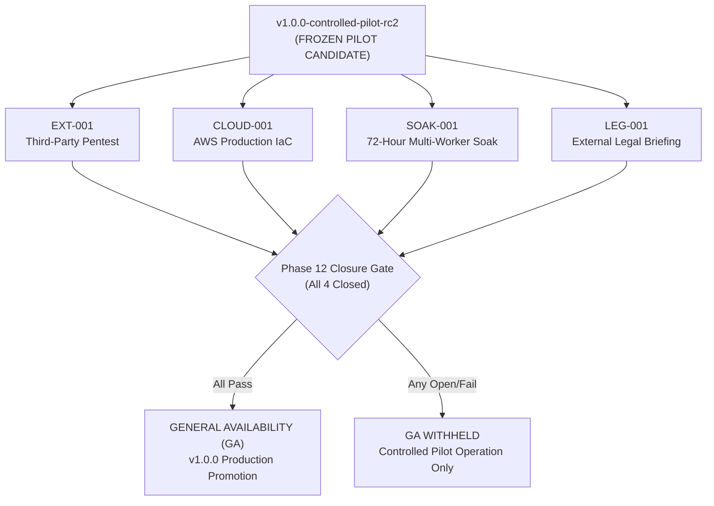
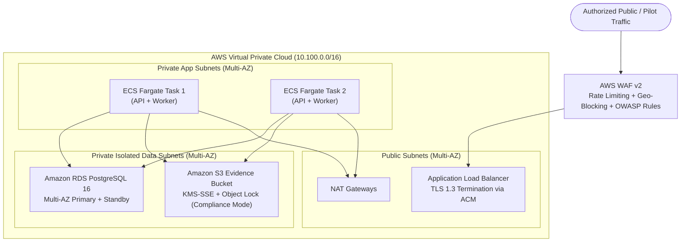

# External Assurance Preparation Package: EXT-001, CLOUD-001, SOAK-001, LEG-001

**Release Candidate:** `v1.0.0-controlled-pilot-rc2`  
**Application:** Digital Impersonation Response Desk  
**Baseline Status:** `LOCAL_RELEASE_FREEZE_READY`  
**Controlled Pilot Status:** OPERATIONAL / PRIVATE STAGING  
**General Availability Status:** STRICTLY WITHHELD  
**Document Date:** 2026-09-16  

---

## Executive Overview

General Availability (GA) is strictly withheld until four mandatory external assurance activities are fully executed and closed. This document provides complete, production-ready specification packages for each external dependency.



---

# 1. EXT-001: Independent Penetration Testing Package

### 1.1 Objective & Target Scope
Engage an accredited external cybersecurity assessment firm (CREST / CERT-In / ISO 27001 certified) to conduct a comprehensive black-box and white-box penetration test against the Digital Impersonation Response Desk application.

- **Primary Target:** Staging API and Single-Page Application (`http://100.100.25.15:4001` / staging proxy)
- **Codebase Access:** Full source code repository provided under NDA.
- **Testing Window:** 10 business days.
- **Reporting Standard:** CVSS v3.1 scoring, OWASP Top 10 (2021), OWASP API Security Top 10 (2023), ASVS Level 2 compliance.

### 1.2 Required Attack Vectors & Evaluation Criteria

| Focus Area | Specific Test Cases | Pass / Acceptance Criteria |
|---|---|---|
| **Multi-Tenant Isolation (IDOR)** | Attempt horizontal cross-tenant access to cases, evidence, candidates, and playbooks across `org_apex_health_01` and `org_bharatfin_02`. Test header spoofing (`X-Organization-ID`), parameter tampering, and route hopping. | Zero unauthorized cross-tenant read or write access; responses must return 404 (not 403) to prevent ID enumeration. |
| **Authentication & Tokens** | Session token forgery, HMAC secret brute force, signature stripping, algorithm confusion (none/HS256), token expiration bypass, and replay attacks. | All tampered or invalid tokens rejected with HTTP 401; zero unauthorized privilege escalation. |
| **Cryptographic Custody & Holds** | Attempt deletion or modification of evidence while statutory legal hold is active (`legal_hold = 1`). Attempt bypass of Two-Person authorization rule on evidence disposal. | Legal hold returns HTTP 409 Conflict unconditionally; requester self-approval rejected with HTTP 400/403. |
| **SSRF & Network Boundary** | Ingestion of cloud metadata IPs (`169.254.169.254`), loopback representations (`0x7f000001`, `2130706433`), private subnets (RFC 1918), and DNS rebinding probes in source capture. | URL validator blocks private/restricted IPs with HTTP 400; zero outbound TCP connections to internal subnets. |
| **Client-Side & Content Security** | XSS payload injection in case titles, evidence display names, and triage notes. Evaluation of Tailwind CDN script-src and `'unsafe-eval'` directive. | Dynamic text rendered safely via `textContent`; zero script execution; exfiltration blocked by connect-src `'self'`. |
| **Emergency Controls** | Verification that administrative emergency kill-switch (`POST /api/integrations/kill-switch`) halts all webhook ingestion (HTTP 503) and scheduled polling across all tenant connections. | Zero signals ingested while kill switch is engaged. |

### 1.3 Pre-Provisioned Test Accounts
The external testing team will be provisioned with five distinct role-based personas across two isolated organizations:
1. `sysadmin@desk.example` (System Administrator)
2. `dr.verma@apexhealth.example` (Org Owner, Apex Health)
3. `priya.nair@apexhealth.example` (Case Manager, Apex Health)
4. `adv.menon@apexhealth.example` (Legal Reviewer, Apex Health)
5. `vikram.seth@bharatfin.example` (Case Manager, BharatFin - Tenant B)

---

# 2. CLOUD-001: AWS Production Cloud Infrastructure as Code (Terraform) Package

### 2.1 Target Architecture Specification
For General Availability, the application transitions from single-node staging SQLite to a high-availability, auto-scaling, cloud-native AWS topology:



### 2.2 Terraform Module Structure & Components
The `terraform/` directory defines modular, declarative infrastructure:

```
terraform/
├── main.tf                 # Provider configuration, backend state, module invocations
├── variables.tf            # Environment-specific variables (CIDRs, domain, instance types)
├── outputs.tf              # ALB DNS, ECS Cluster ARN, RDS endpoint, S3 bucket ARN
├── modules/
│   ├── vpc/                # Multi-AZ VPC, subnets, route tables, NAT Gateways
│   ├── security_groups/    # Strict ingress/egress firewalls (ALB -> ECS -> RDS)
│   ├── alb/                # Application Load Balancer, ACM TLS certificate, target groups
│   ├── waf/                # AWS WAF v2 Web ACL (Rate limiting, SQLi, XSS, IP reputation)
│   ├── ecs/                # ECS Cluster, Fargate Task Definitions, Auto-scaling policies
│   ├── rds/                # Aurora / RDS PostgreSQL Multi-AZ, automated backups, KMS encryption
│   ├── s3_evidence/        # S3 bucket with Object Lock (WORM), versioning, KMS-SSE
│   └── kms/                # Customer Managed Keys (CMK) with automated annual rotation
└── environments/
    ├── staging.tfvars      # Private staging variables
    └── production.tfvars   # GA production variables
```

### 2.3 Key Security Invariants in IaC
1. **Zero Public Database Exposure:** RDS instances reside in dedicated non-routable subnets with 0 internet gateways. Ingress is restricted to ECS security groups on port 5432.
2. **Immutable Evidence Storage (WORM):** S3 Object Lock configured in `COMPLIANCE` mode prevents deletion or tampering of evidence files during statutory retention windows, even by AWS root accounts.
3. **Envelope Encryption:** All database storage, EBS task volumes, and S3 objects are encrypted at rest using dedicated AWS KMS CMKs with strict IAM key policies.
4. **Secrets Management:** Database passwords, session secrets, and OAuth client credentials are dynamically injected into ECS containers from AWS Secrets Manager using IAM role delegation.

---

# 3. SOAK-001: 72-Hour Continuous Multi-Worker Soak Protocol

### 3.1 Test Objectives & Constraints
Validate application stability, memory bounds, database file growth, concurrency controls, and failure resilience under uninterrupted 72-hour operational load across all 8 background worker threads.

- **Duration:** 72 continuous hours (4,320 minutes).
- **Target Instance:** Staging server runtime (`task-8190` / staging daemon).
- **Worker Concurrency:** All 8 workers active simultaneously:
  1. `polling-detection` (every 60s)
  2. `webhook-ingestion` (continuous)
  3. `reupload-monitoring` (every 120s)
  4. `sla-escalation` (every 30s)
  5. `evidence-retention` (every 300s)
  6. `audit-stream` (continuous)
  7. `usage-metering` (every 60s)
  8. `background-sync` (every 60s)

### 3.2 Synthetic Load Profile

| Activity | Frequency / Rate | Daily Volume | Total 72h Volume |
|---|---|---|---|
| **Incident Case Intake** | 10 synthetic cases / hour | 240 cases | 720 cases |
| **Evidence Attachments** | 20 screenshots + source URLs / hour | 480 evidence records | 1,440 records |
| **Signal Ingestion** | 100 synthetic detection signals / hour | 2,400 signals | 7,200 signals |
| **Candidate Correlation Cycles** | 1 evaluation cycle / 5 minutes | 288 cycles | 864 cycles |
| **SLA Escalation Sweeps** | Continuous (30s interval) | 2,880 sweeps | 8,640 sweeps |
| **Retention Policy Audits** | 1 sweep / hour | 24 sweeps | 72 sweeps |

### 3.3 Pass / Fail SLIs and Thresholds

| Metric | Measurement Tool | Acceptable Threshold | Failure Condition |
|---|---|---|---|
| **Node.js Process Memory (RSS)** | `process.memoryUsage().rss` | Baseline + < 150 MB growth | Unbounded growth / > 500 MB RSS |
| **V8 Heap Used** | `process.memoryUsage().heapUsed` | Flat sawtooth pattern (GC active) | Heap growth > 250 MB indicating leak |
| **Event Loop Latency** | `perf_hooks.monitorEventLoopDelay` | p95 < 20 ms, p99 < 50 ms | Event loop lag > 100 ms |
| **SQLite WAL Checkpoint** | PRAGMA wal_checkpoint | Checkpoint duration < 200 ms | WAL file size > 50 MB sustained |
| **API Response Time (p95)** | Synthetic health & case probes | p95 < 50 ms | p95 > 250 ms |
| **Process Restarts** | PID stability monitoring | Exactly 0 unhandled crash/restarts | Any unplanned process termination |

---

# 4. LEG-001: External Legal Counsel Briefing Package

### 4.1 Purpose of Briefing
Equip external legal counsel to review the statutory notices, evidentiary chain of custody, and regulatory workflows implemented by the Response Desk under Indian digital media and cybersecurity laws.

### 4.2 Core Statutory Frameworks Evaluated

1. **Information Technology Act, 2000:**
   - **Section 66C:** Punishment for identity theft (fraudulent use of electronic signature, password, or unique identification feature).
   - **Section 66D:** Punishment for cheating by personation by using computer resource.
   - **Section 79(3)(b):** Intermediary safe harbor immunity conditional on expeditious removal upon receiving "actual knowledge" or grievance officer notice.

2. **Information Technology (Intermediary Guidelines and Digital Media Ethics Code) Rules, 2021:**
   - **Rule 3(1)(b):** Obligation of intermediaries to prohibit hosting impersonation, defamatory, or misleading content.
   - **Rule 3(2)(b):** Mandatory 24-hour expedited removal window for content depicting an individual in a fake, morphed, or impersonating manner.
   - **Rule 3(2)(a):** 72-hour general grievance redressal response timeframe.

3. **Digital Personal Data Protection Act, 2023 (DPDPA):**
   - Personal data minimization in evidence capture (hashing, obscuring PII, 90-day default retention).
   - Lawful basis for processing without consent for statutory compliance and judicial proceedings.

### 4.3 Key Items Submitted to Counsel for Written Opinion

1. **Notice Template Form & Enforceability:**
   - Review of `submissionPacketService.generatePacket()` markdown output.
   - Counsel opinion requested: Does the canonical JSON manifest and SHA-256 custody digest constitute legally sufficient "actual knowledge" to trigger intermediary liability under Section 79(3)(b)?
2. **Chain of Custody Defensibility:**
   - Review of SHA-256 checksum generation, disk-backed streaming capture, immutable audit log records, and two-person deletion approval.
   - Counsel opinion requested: Are evidence packages generated by the desk admissible under Section 65B of the Indian Evidence Act (electronic evidence certification)?
3. **Safety Disclaimers in Controlled Pilot:**
   - Evaluation of dry-run simulation notices and clear labeling prohibiting unauthorized automated dispatch.
   - Counsel opinion requested: Confirmation that dry-run notice generation creates zero intermediary or tort liability during pilot phase.

---

## 5. Summary of Assurance Gate Status

| Assurance Activity | Deliverable Artifact | Owner / Lead | Current Status |
|---|---|---|---|
| **EXT-001** | Third-Party Penetration Test Report & Attestation | Accredited External Security Firm | **OPEN / EXTERNAL DEPENDENCY** |
| **CLOUD-001** | Production AWS IaC Terraform Package & Deployment Guide | Cloud & DevOps Engineering | **OPEN / EXTERNAL DEPENDENCY** |
| **SOAK-001** | 72-Hour Soak Test Telemetry & Memory Stability Report | QA & Release Engineering | **OPEN / EXTERNAL DEPENDENCY** |
| **LEG-001** | External Counsel Legal Opinion on Notice Defensibility | Specialized Cyber Law Counsel | **OPEN / EXTERNAL DEPENDENCY** |

> [!IMPORTANT]
> General Availability remains **STRICTLY WITHHELD**. All four assurance activities must return formal passing attestations before GA promotion may be considered.
