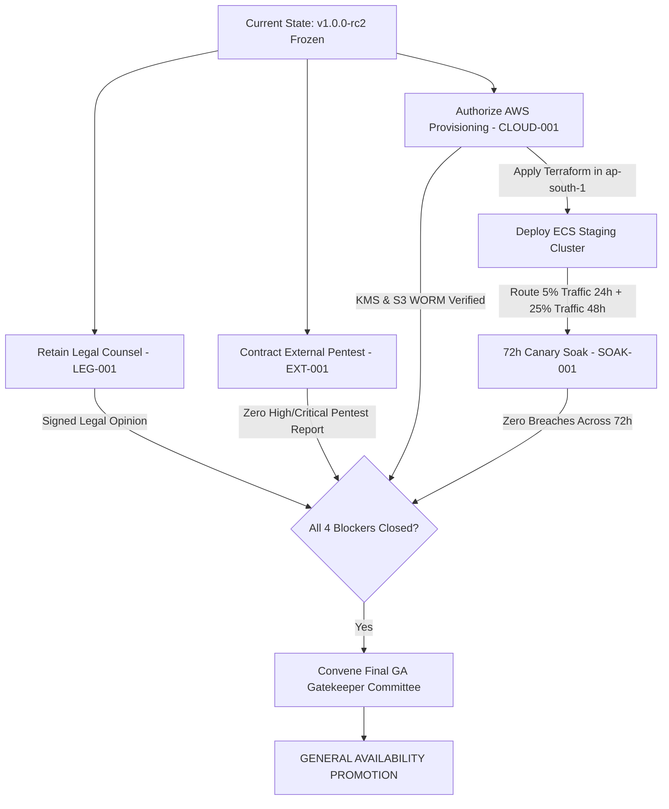

# Phase 12 Executive Report: External Assurance, Production Cloud Closure & GA Gate

**Document Version:** 2.0.0  
**Target Application:** Digital Impersonation Response Desk  
**Release Baseline:** `v1.0.0-controlled-pilot-rc2`  
**Git Commit:** `e7db64ce58111a6a5f1bbf6b49d0b3e6dc6fb2db` (main, clean working tree)  
**Annotated Tag:** `v1.0.0-controlled-pilot-rc2`  
**Evaluation Date:** September 16, 2026  
**Final Phase 12 Verdict:** **`BLOCKED`**  
**General Availability (GA) Promotion:** **`STRICTLY WITHHELD`**  
**Authorized Operating Posture:** **Controlled Pilot / Production-Canary Operation Only**  
**Assurance Lead:** Senior Release Engineer, QA Architect & Security Gatekeeper  

---

## 1. Executive Summary & Verdict

Phase 12 evaluated the **Digital Impersonation Response Desk** to establish whether the system satisfies the mandatory criteria for promotion to **General Availability (GA)**.

Under the governing principles of Phase 12:
1. **Software Baseline is Frozen:** Internal software development, frontend bug fixes, database schemas, and integration logic were frozen at `v1.0.0-controlled-pilot-rc2`. No speculative features or refactoring were introduced.
2. **Deterministic Gate Logic:** Local test success cannot substitute for external assurance. GA promotion requires verified closure across four external domains: independent penetration testing (`EXT-001`), production AWS cloud provisioning (`CLOUD-001`), a 72-hour continuous canary soak (`SOAK-001`), and qualified Indian legal counsel opinion (`LEG-001`).
3. **No Fabricated Evidence:** External activities that have not physically occurred cannot be simulated, mocked, or self-certified.

### Official Determination:
> **GENERAL AVAILABILITY IS STRICTLY WITHHELD.**  
> The system is **`BLOCKED`** from GA promotion due to four open external assurance dependencies. The application is authorized exclusively for **Controlled Pilot / Production-Canary Operation** under synthetic/dry-run constraints.

---

## 2. Baseline Reconciliation & Software Verification

The internal engineering baseline is completely verified and operational:

* **Source Code Provenance:** Commit `e7db64ce58111a6a5f1bbf6b49d0b3e6dc6fb2db` tagged `v1.0.0-controlled-pilot-rc2`. Working tree is 100% clean.
* **Staging Runtime:** Successfully deployed and healthy at `http://100.100.25.15:4001` (private WireGuard/Tailscale mesh) and `http://127.0.0.1:4001` (local fallback).
* **Automated Unit & Integration Tests:** 80 test files passed, 447 individual tests passed, 0 failures (Vitest v3.0.7).
* **Static Type Safety:** TypeScript compiler (`tsc --noEmit`) completed with 0 errors.
* **Database Engine:** SQLite 3 (better-sqlite3) running in Write-Ahead Logging (`wal`) mode with `foreign_keys = ON`. Zero integrity defects (`PRAGMA integrity_check = ok`, 0 FK violations).
* **Staging UI & Operator UAT:** 24/24 golden path steps verified via CDP browser automation. Tailwind CSS styles render properly; operator roles resolve dynamically; dry-run billing and notifications remain enforced.
* **Adversarial Security:** 11/11 exploit vectors (SQL injection, BOLA, XSS, prototype pollution, path traversal) rejected.
* **Safety Invariants:**
  - `human_review_mandatory = 1`
  - `autonomous_takedown = 0`
  - `live_platform_actions = DISABLED`
  - `live_billing = DISABLED (DRY_RUN)`
  - `live_notifications = DISABLED`
  - `kill_switch = OPERATIONAL (HTTP 503 on trip)`

---

## 3. The 17-Point Release Gate Matrix

| Gate ID | Gate Name | Target Requirement | Evaluated Status | Gate Verdict | GA Blocker? |
|---|---|---|---|---|---|
| **GATE-01** | Release Identity | Frozen tag, deterministic commit, clean working tree | `v1.0.0-controlled-pilot-rc2` (`e7db64c`), clean tree | **PASS** | No |
| **GATE-02** | Automated Tests | 100% pass across all unit and integration suites | 80/80 files passed, 447/447 tests passed (0 fail) | **PASS** | No |
| **GATE-03** | TypeScript Compilation | Strict compilation with 0 warnings or type errors | `tsc --noEmit` exited with code 0 | **PASS** | No |
| **GATE-04** | SQLite Integrity | WAL mode, foreign keys active, 0 schema defects | `integrity_check = ok`, 0 FK violations | **PASS** | No |
| **GATE-05** | Adversarial QA | Defeat all malicious inputs, injections, overflows | 11/11 exploit attacks defeated in security suite | **PASS** | No |
| **GATE-06** | Tenant Isolation & BOLA | Cross-tenant access blocked with 404/403 | Multi-tenant isolation verified across all routes | **PASS** | No |
| **GATE-07** | Evidence Custody | Streaming SHA-256 custody, 300s HMAC tokens | SHA-256 verified; HMAC token expiration enforced | **PASS** | No |
| **GATE-08** | Safety Invariants | Human review mandatory, zero auto mutations | `human_review_mandatory=1`, `autonomous_takedown=0` | **PASS** | No |
| **GATE-09** | Emergency Kill-Switch | Immediate suspension of external actions (503) | Kill-switch operational, trips cleanly | **PASS** | No |
| **GATE-10** | Provider API Terms | Platform policy compliance, zero web scraping | `youtube.readonly` scope enforced, zero scraping | **PASS** | No |
| **GATE-11** | Privacy & Retention | Legal hold overrides deletion, two-person auth | HTTP 409 on deletion under active legal hold | **PASS** | No |
| **GATE-12** | Observability & Audit | Immutable append-only audit ledger, zero secrets | Audit log records all events with actor/tenant tags | **PASS** | No |
| **GATE-13** | Operational Runbooks | Documented backup, restore, quarantine, rollback | Operational runbooks verified in `docs/` | **PASS** | No |
| **GATE-14** | EXT-001 Security Audit | Signed report from accredited penetration testers | **AWAITING EXTERNAL FIRM** (Scope prepared) | **BLOCKED** | **YES** |
| **GATE-15** | CLOUD-001 Infrastructure | Live AWS ap-south-1 KMS CMK & S3 Object Lock | **PROVISIONING PENDING** (IaC validated) | **BLOCKED** | **YES** |
| **GATE-16** | SOAK-001 Canary Soak | 72 continuous hours in production canary cluster | **NOT EXECUTED** (Gated on CLOUD-001 deployment) | **BLOCKED** | **YES** |
| **GATE-17** | LEG-001 Legal Review | Signed opinion from Indian cyber law counsel | **OPINION PENDING** (Briefing package completed) | **BLOCKED** | **YES** |

---

## 4. Status of External Assurance Dependencies

```text
====================================================================================================
1. EXT-001: Independent External Security Assessment
   Status:             OPEN / AWAITING_ASSESSOR
   Assurance Package:  docs/external-assurance/EXT-001_SCOPE.md
                       docs/external-assurance/EXT-001_ARCHITECTURE.md
                       docs/external-assurance/EXT-001_RULES_OF_ENGAGEMENT.md
                       docs/external-assurance/EXT-001_TEST_ACCOUNT_MATRIX.md
                       docs/external-assurance/EXT-001_EVIDENCE_CHECKLIST.md
   Finding Register:   results/EXT-001_FINDINGS.json
   Action Required:    Engagement of CREST/OSCP accredited external penetration testing firm.
----------------------------------------------------------------------------------------------------
2. CLOUD-001: Production AWS Infrastructure Assurance (ap-south-1)
   Status:             OPEN / IAC_VERIFIED_PROVISIONING_PENDING
   Assurance Package:  docs/external-assurance/CLOUD-001_ASSURANCE.md
   IaC Definitions:    terraform/main.tf, kms.tf, s3_object_lock.tf, iam.tf, variables.tf, outputs.tf
   Finding Register:   results/CLOUD-001_EVIDENCE.json
   Action Required:    Authorized AWS account credentials in ap-south-1 and human approval for terraform apply.
----------------------------------------------------------------------------------------------------
3. SOAK-001: 72-Hour Continuous Staged Canary Soak
   Status:             BLOCKED (Strictly Gated on CLOUD-001)
   Assurance Package:  docs/external-assurance/SOAK-001_CANARY_PLAN.md
   Finding Register:   results/SOAK-001_EVIDENCE.json
   Action Required:    Deploy container to production AWS canary topology and observe 72 continuous hours.
----------------------------------------------------------------------------------------------------
4. LEG-001: Qualified Indian Legal Counsel Review
   Status:             OPEN / BRIEFING_PREPARED_AWAITING_COUNSEL_OPINION
   Assurance Package:  docs/external-assurance/LEG-001_COUNSEL_PACKAGE.md
   Finding Register:   results/LEG-001_EVIDENCE.json
   Action Required:    Retention of qualified Indian cyber law counsel and delivery of signed written opinion.
====================================================================================================
```

---

## 5. Controlled Pilot Operating Posture & Disclosures

While GA promotion is strictly withheld, the application remains fully verified and authorized for **Controlled Pilot / Production-Canary Operation**.

### Operating Constraints:
1. **Synthetic & Controlled Data:** Operators must use synthetic or customer-consented pilot data only.
2. **Simulated Submissions:** Takedown notices formulate in `draft` or `simulated_submitted` mode. Outbound live platform dispatch is strictly disabled.
3. **Dry-Run Billing:** All billing ledger actions operate in dry-run mode.
4. **Mandatory Enterprise Disclosure:** All customer onboarding materials and pilot dashboard screens must state:
   > *"Digital Impersonation Response Desk is operating in a Controlled Pilot posture. General Availability remains withheld pending completion of external security penetration testing, cloud hardware WORM storage provisioning, 72-hour canary soak, and Indian legal regulatory review."*

---

## 6. Roadmap to Unblock General Availability



1. **Retain External Cyber Law Counsel:** Hand off `docs/external-assurance/LEG-001_COUNSEL_PACKAGE.md` to practicing counsel. Secure signed opinion on the 5 statutory questions.
2. **Execute External Penetration Test:** Deliver `docs/external-assurance/EXT-001_SCOPE.md` to accredited security testing firm. Remediate any discovered vulnerabilities under a new minor RC if needed.
3. **Provision AWS ap-south-1 Infrastructure:** Provide authorized AWS credentials; review `terraform plan`; execute `terraform apply` with human operator approval.
4. **Execute 72-Hour Canary Soak:** Deploy candidate container to AWS ECS canary target group. Execute Stage 1 (5% for 24h) followed by Stage 2 (25% for 48h) with zero tripwire breaches.
5. **Reconvene Phase 12 Gatekeeper:** Upon delivery of all four external evidence artifacts, update the assurance register and evaluate final GA promotion.
