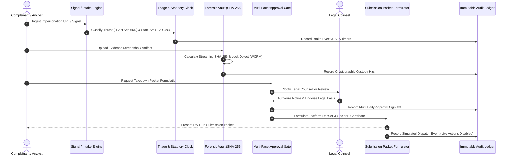

# Data Flow Architecture

**Application:** Digital Impersonation Response Desk  
**Baseline Release:** `v1.0.0-controlled-pilot-rc2`  

---

## 1. End-to-End Incident Response Lifecycle

The flow of data through the system progresses through discrete, audited stages with clear cryptographic and human-review gates.

---

## 2. Detailed Data Flow Stages

### Stage 1: Signal Ingestion & URL Normalization
1. **Intake Source:** Inbound signals arrive via manual analyst entry, WebSub webhooks, or file replay adapters (`src/services/monitoring/adapters/`).
2. **URL Sanitization (`url-normalization-service.ts`):**
   - Strips tracking parameters (`utm_*`, `fbclid`, `igsh`, `si`).
   - Standardizes canonical domain names (e.g. `youtu.be` → `youtube.com/watch?v=`).
   - Validates URL against SSRF filters (blocks `127.0.0.1`, `169.254.169.254`, `10.0.0.0/8`).
3. **Deduplication (`duplicate-detection-service.ts`):**
   - Matches incoming URLs against active cases within the tenant context.

---

### Stage 2: Triage Scoring & Statutory Clock Initialization
1. **Threat Evaluation (`triage-service.ts`):**
   - Analyzes target profile (Executive, Brand, Healthcare Provider).
   - Classifies statutory violation:
     - IT Act Section 66D (Cheating by personation).
     - IT Act Section 66E / Rule 3(2)(b) (Violation of privacy / deepfake content).
     - Copyright / Trademark infringement.
2. **Statutory SLA Timer (`statutory-clock-service.ts`):**
   - High-priority / impersonation incidents: **72-hour mandatory resolution clock** (IT Rules 2021).
   - Mandatory acknowledgement: **24-hour clock**.
   - Workers evaluate clock ticks hourly and trigger escalation warnings before deadline expiration.

---

### Stage 3: Evidence Capture & Cryptographic Custody
1. **Streaming Upload (`src/services/source-capture.ts`, `evidence-hasher.ts`):**
   - Evidence file is ingested as a stream with max 50 MB bound.
   - Streaming SHA-256 hash is computed in chunks as bytes arrive on the wire.
   - Magic bytes are checked to verify legitimate image/video formats (JPEG, PNG, MP4, PDF).
2. **Storage Key Isolation:**
   - Object is stored under an opaque UUID key (e.g. `ev_apex_001.bin`). Raw user-supplied filenames are never used on disk.
3. **Custody Metadata Creation:**
   - Database record generated in `evidence_items` binding file hash, byte length, upload timestamp, uploading user ID, and tenant ID.
4. **WORM Lock Enforcement:**
   - Object Lock is set to COMPLIANCE mode with a minimum 180-day retention lock per Rule 3(1)(h) of the IT Rules 2021.
   - Attempted deletion during active retention or under active legal hold is rejected with HTTP 409 Conflict.

---

### Stage 4: Multi-Facet Human Approval Governance
1. **Separation of Duty:**
   - An Analyst or Case Manager drafts the proposed grievance complaint.
   - Formal sign-offs are required across distinct facets:
     - `EvidenceSpecialist`: Confirms SHA-256 custody, screenshot authenticity, and metadata completeness.
     - `LegalCounsel`: Confirms statutory grounding under Indian cyber law and platform terms.
2. **Approval Verification (`src/domain/approval-state-machine.ts`):**
   - Single-actor self-approval is rejected for high-priority executive impersonations.
   - All approval records are cryptographically timestamped in `submission_approvals`.

---

### Stage 5: Submission Packet Formulation & Dry-Run Dispatch
1. **Dossier Generation (`submission-packet-service.ts`):**
   - Formulates platform-specific notice payload (Meta, Google, X, Telegram).
   - Generates an evidentiary certificate referencing SHA-256 hashes and timestamped screenshots.
2. **Controlled Pilot Guard:**
   - The system checks `PILOT_MODE=true` and `ENABLE_LIVE_PLATFORM_ACTIONS=false`.
   - The submission status transitions to `simulated_submitted`.
   - Zero outbound requests are sent to external social media platforms. The operator receives the full formatted legal packet for manual review and delivery.
