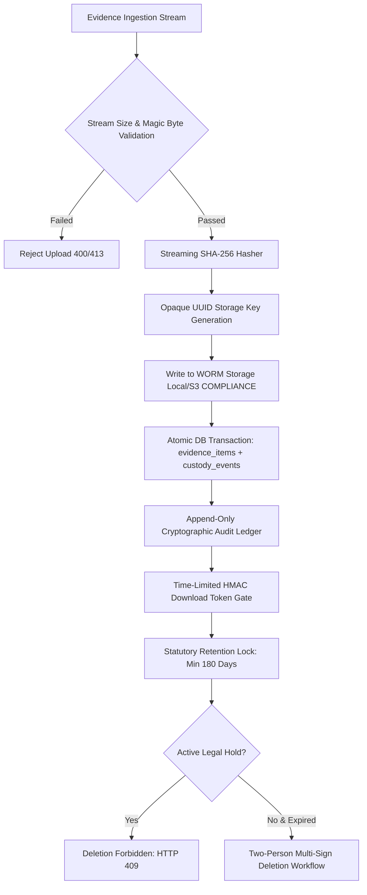

# Evidence Architecture & Forensic Chain of Custody

**Application:** Digital Impersonation Response Desk  
**Specification ID:** ENG-EVID-CUSTODY-v1.0  
**Release Baseline:** `v1.0.0-controlled-pilot-rc2`  

---

## 1. The Forensic Evidence Problem

When responding to online impersonation campaigns, deepfakes, and corporate executive fraud, evidentiary integrity is paramount. In legal proceedings (e.g. filing FIRs under Section 66D of the IT Act, 2000) or formal intermediary grievance notices (under Rule 3 of the IT Rules 2021), evidence submitted by victims is frequently challenged on grounds of:
* Post-capture modification or metadata tampering
* Failure to establish continuous custody from acquisition to submission
* Ambiguity regarding exact time, device, and network origin
* Uncontrolled operator access or unauthorized deletion

To ensure digital evidence is legally defensible and admissible in courts (pursuant to Section 65B of the Indian Evidence Act, 1872 / Section 63 of Bharatiya Sakshya Adhiniyam, 2023), the Response Desk implements a strict, automated **Forensic Chain of Custody Pipeline**.

---

## 2. Chain of Custody Pipeline



---

## 3. Cryptographic & Operational Controls

### 3.1 Streaming SHA-256 Hashing (`src/services/evidence-hasher.ts`)
* Evidence files are hashed *asynchronously as chunks arrive over the HTTP stream*.
* Memory consumption remains constant ($O(1)$) regardless of file size, preventing memory exhaustion under concurrent uploads.
* The hash digest is committed to the database atomically before the storage backend marks the object as active.

### 3.2 Magic-Byte & MIME Validation
* File extensions can be trivially spoofed (e.g., uploading an executable disguised as `.png`).
* The intake service inspects initial byte sequences (magic bytes) to verify legitimate digital evidence types:
  - `JPEG`: `FF D8 FF`
  - `PNG`: `89 50 4E 47 0D 0A 1A 0A`
  - `PDF`: `25 50 44 46`
  - `MP4`: `ftyp` box marker
* Files failing magic-byte inspection are rejected with `HTTP 400 Bad Request`.

### 3.3 Bounded Upload Streams (`src/security/streaming-upload-limits.ts`)
* Maximum upload size is strictly bounded to **50 MB** (`MAX_UPLOAD_SIZE_MB=50`).
* Multipart streams exceeding 50 MB are terminated immediately with `HTTP 413 Payload Too Large` without buffering the full payload to disk.

### 3.4 Opaque Storage Key Isolation
* Original user-supplied filenames (e.g. `screenshot ../../etc/passwd.jpg`) are stripped to prevent path traversal attacks.
* Objects are stored under random, opaque UUID v4 identifiers (e.g., `ev_9f4b12c8-8831-419b-a615-1102948bb012.bin`).
* The original metadata is stored in an encrypted relational record accessible only to authenticated organization members.

### 3.5 Time-Limited HMAC Download Tokens (`src/services/evidence-service.ts`)
* Digital evidence files are never served over public, unauthenticated URLs.
* To view or download evidence, an authenticated operator must request a download token.
* The token is an HMAC-SHA256 signature containing:
  ```json
  {
    "evidence_id": "ev_apex_001",
    "organization_id": "org_apex_health_01",
    "user_id": "usr_apex_mgr_02",
    "expires_at": 1726589100
  }
  ```
* Tokens have a maximum lifetime of **300 seconds** (`SIGNED_URL_EXPIRY_SECONDS=300`). Replay attempts after expiration return `HTTP 401 Unauthorized`.

---

## 4. Retention, Legal Holds & Two-Person Deletion

### 4.1 Statutory WORM Retention (IT Rules 2021 Rule 3(1)(h))
* Rule 3(1)(h) of the IT Rules 2021 requires preserving information and records relating to an incident for at least **180 days** following grievance resolution.
* S3 Object Lock is configured in **`COMPLIANCE` mode** (`terraform/s3_object_lock.tf`) with a default retention period of 180 days.
* In COMPLIANCE mode, no AWS user—including the AWS root account—can overwrite or delete the object until the retention window has expired.

### 4.2 Legal Hold Overrides
* If an incident enters active litigation or law enforcement investigation, an authorized Case Manager or Legal Counsel can flag the evidence with an **Active Legal Hold**.
* While a legal hold is active:
  - All automated retention purges are suspended.
  - Any deletion attempt via API returns **`HTTP 409 Conflict: OBJECT_UNDER_LEGAL_HOLD`**.
  - Verified in automated test suite: `tests/security/deletion-two-person.test.ts`.

### 4.3 Two-Person Deletion Workflow (`src/services/retention-service.ts`)
* When an unheld evidence object surpasses its 180-day retention period, it cannot be deleted by a single administrator.
* Deletion requires a **two-person authorization workflow**:
  1. Operator A (`OrgAdmin` or `EvidenceSpecialist`) submits a deletion request. The evidence enters `pending_deletion` state.
  2. Operator B (`LegalCounsel` or `SystemAdmin`) inspects the request and signs off.
  3. Only upon dual authorization does the system execute crypto-shredding and physical deletion.
  4. Both authorizations are logged to the immutable audit ledger.

---

## 5. Electronic Record Certification (Section 65B IEA / Section 63 BSA)

To support legal proceedings in Indian courts, the system automatically compiles an evidentiary certificate for every finalized case:
* Identifies computer resource and hash algorithms used.
* Embeds RFC 3161 timestamps and capture device details.
* Binds the SHA-256 hash of the evidence object to the complainant's identity.
* Prints standard statutory declaration language for the responsible officer.
