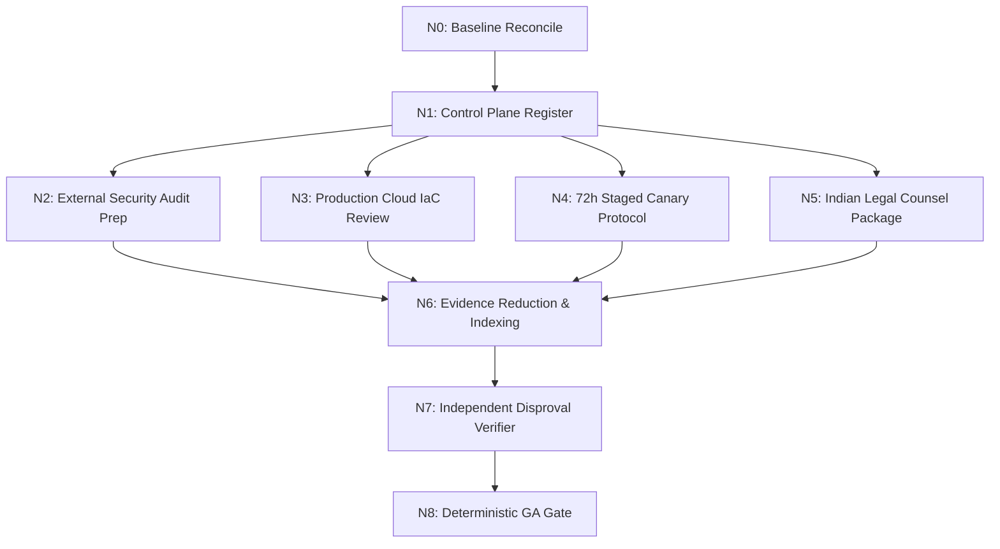

# Graph Engineering: Dependency-Driven Architecture & Execution

**Application:** Digital Impersonation Response Desk  
**Paradigm:** Directed Acyclic Graph (DAG) Engineering for Mission-Critical Systems  

---

## 1. Why Graph Engineering?

In complex software systems—particularly those handling multi-tenant forensic evidence, statutory compliance deadlines, and multi-faceted security controls—engineering workflows frequently collapse under the weight of **artificial serialization** or **unconstrained looping**.

* **The Failure of Monolithic Sequential Pipelines:** When auditing, testing, or processing an incident serially (`Step 1 → Step 2 → Step 3 → ...`), failures in independent subdomains (e.g. cloud provisioning or legal briefing) block completely unrelated work (such as test suite verification or threat modeling).
* **The Danger of Autonomous Loops:** Unbounded loops without formal termination conditions lead to state drift, non-deterministic bugs, and infinite retry storms.

**Graph Engineering** structures all complex development, operational, and assurance tasks as explicit **Directed Acyclic Graphs (DAGs)** with typed nodes, immutable input/output artifacts, and deterministic evaluation gates.

---

## 2. Graph Engineering Execution Model

### 2.1 The Seven Core Principles of Graph Engineering

1. **Explicit Nodes:** Every engineering task is encapsulated in a discrete node with well-defined inputs, preconditions, and deliverables.
2. **Real Dependency Edges Only:** Edges represent physical or logical data dependencies. If Task B does not consume the output of Task A, they execute concurrently.
3. **Fan-Out / Fan-In Topology:**
   - **Fan-Out:** Once baseline reconciliation (`N0/N1`) completes, specialized investigations (Security, Cloud, Reliability, Legal) fan out in parallel.
   - **Fan-In (Reduction):** The Evidence Reducer node (`N6`) aggregates findings into a unified, machine-readable register before gate evaluation.
4. **Independent Verification & Disproval:** A separate, unpolluted verification node (`N7`) actively attempts to *disprove* the success claims of prior nodes using adversarial tests.
5. **Deterministic Routing:** Conditional branches use explicit status codes (`PASS`, `BLOCKED`, `CONDITIONAL`) rather than probabilistic heuristics.
6. **Failure Containment & Bounded Retries:** Failures in an isolated node (e.g. AWS credential absence in `CLOUD-001`) contain their blast radius to that specific branch without halting internal test execution.
7. **No Fabricated Evidence:** If an external edge requires a third-party signature, live cloud API, or physical elapsed time, the node halts at `OPEN / BLOCKED`. Simulation is never substituted for physical reality.

---

## 3. Concrete Example: Phase 12 Assurance Graph

The evaluation of the Phase 12 General Availability Gate demonstrates Graph Engineering in practice:

| Node ID | Node Name | Type | Input Dependencies | Output Artifact | Status |
|---|---|---|---|---|---|
| **N0** | Authoritative Baseline | Reconcile | Git HEAD, Staging Server | `results/PHASE12_BASELINE.json` | **PASS** |
| **N1** | Assurance Control Plane | Register | N0 Baseline | `results/ASSURANCE_REGISTER.json` | **PASS** |
| **N2** | EXT-001 Pentest Scope | Specification | N1 Register | `docs/external-assurance/EXT-001_*.md` | **PASS (OPEN)** |
| **N3** | CLOUD-001 Cloud IaC | Audit | N1 Register, `terraform/` | `docs/external-assurance/CLOUD-001_ASSURANCE.md` | **PASS (OPEN)** |
| **N4** | SOAK-001 Canary Plan | SRE Design | N1 Register, N3 IaC | `docs/external-assurance/SOAK-001_CANARY_PLAN.md` | **BLOCKED (On Cloud)** |
| **N5** | LEG-001 Legal Brief | Compliance | N1 Register, IT Rules 2021 | `docs/external-assurance/LEG-001_COUNSEL_PACKAGE.md` | **PASS (OPEN)** |
| **N6** | Evidence Indexing | Reducer | N2, N3, N4, N5 Outputs | `results/ASSURANCE_EVIDENCE_INDEX.json` | **PASS** |
| **N7** | Independent Verifier | Adversarial | N6 Evidence Index | Fresh-Context Negative Verification | **PASS** |
| **N8** | Final GA Gate | Gatekeeper | N6, N7 Evaluations | `results/FINAL_GA_GATE.json` | **BLOCKED (Withheld)** |

---

## 4. Graph Engineering vs. Conventional Loops: Tradeoffs

Graph Engineering is a rigorous architectural pattern, but it introduces specific tradeoffs:

| Dimension | Conventional Iterative Loop | Graph Engineering (DAG) | When to Use Which |
|---|---|---|---|
| **Execution Overhead** | Low (single execution thread) | Higher (requires node state tracking and artifact schemas) | Use Loops for simple local refactoring; use Graphs for multi-party release pipelines |
| **Parallelism** | None (sequential blocking) | Maximum (independent tasks run concurrently) | Use Graphs whenever independent specialist domains exist |
| **Auditability** | Ephemeral (logs in terminal) | Permanent (every node writes an immutable JSON/MD artifact) | Use Graphs for regulated systems requiring chain-of-custody |
| **Failure Recovery** | Restarts entire loop from beginning | Re-executes only the failed node and its downstream dependents | Use Graphs when individual nodes are costly or time-consuming |
| **Determinism** | Vulnerable to state drift | Completely deterministic and reproducible | Use Graphs for release gating and security sign-offs |

**Conclusion:** We do not claim Graph Engineering is universally superior for every software problem. For localized algorithm development, simple unit test loops, or rapid UI experimentation, standard sequential iteration is often more nimble. However, for multi-tenant incident response, cryptographic chain-of-custody verification, and high-assurance release gating, Graph Engineering provides the rigor and visibility essential for mission-critical software.
