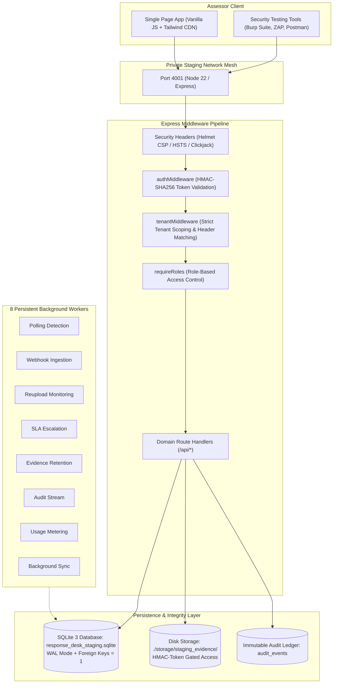

# EXT-001: System Architecture & Security Controls Briefing

**Application:** Digital Impersonation Response Desk  
**Target Release:** `v1.0.0-controlled-pilot-rc2`  
**Audience:** Independent External Security Assessor  
**Date:** 2026-09-16  

---

## 1. High-Level System Architecture

The Digital Impersonation Response Desk is designed as a stateful, modular TypeScript/Express monolith running on Node.js v22. In the controlled pilot / staging deployment, data persistence is handled by an isolated SQLite 3 engine running in Write-Ahead Logging (WAL) mode.

---

## 2. Authentication & Session Architecture

1. **Credentials & Password Storage:**
   - Seeded staging accounts use cryptographic password hashing.
   - Brute-force protection is enforced by `AccountLockoutService` in `src/security/account-lockout.ts`: 5 consecutive failed login attempts result in a mandatory 900-second (15-minute) account lockout returning HTTP 429.
2. **Session Tokens:**
   - Authenticated sessions use signed bearer tokens prefixed with `desk_tok_`.
   - Token format: `desk_tok_<base64url(payload)>.<signature>`.
   - The signature is calculated using HMAC-SHA256 over the base64url payload with a 64-byte secret key (`SESSION_SECRET`).
   - Token validation uses `crypto.timingSafeEqual` to prevent timing analysis attacks.
   - Tokens carry an explicit expiration (`exp`) set to 24 hours.

---

## 3. Multi-Tenant Authorization Model

The application enforces strict data segregation between organizations:
- **Tenant Context (`tenantMiddleware`):**
  - Upon token validation, the user's active organization is extracted from database memberships.
  - If a client supplies an explicit `X-Organization-ID` header that does not match their authorized membership, `tenantMiddleware` immediately rejects the request with **HTTP 403 Forbidden**.
- **Data Access Boundary:**
  - All SQL queries across cases, evidence, notes, escalations, re-uploads, and monitored subjects enforce `WHERE organization_id = ?` using parameterized prepared statements (`better-sqlite3`).
  - Attempting to access an ID belonging to another tenant returns **HTTP 404 Not Found** rather than 403, preventing resource existence enumeration across tenants.

---

## 4. Evidence Custody & Retention Security

1. **Upload & Custody Integrity:**
   - File uploads are streamed via `multer` to temporary disk storage (`storage/staging_temp`), strictly capping payload size at 500 MB to prevent memory exhaustion.
   - The server streams the file through `crypto.createHash('sha256')`, computing an immutable custody hash before moving the file to persistent tenant storage.
2. **Download Token Authorization:**
   - Direct binary file paths are never exposed.
   - Evidence retrieval requires requesting a short-lived (300 seconds), single-use HMAC-signed download token via `GET /api/evidence/:id/download-token`.
   - The download endpoint (`GET /api/evidence/:id/download?token=...`) rejects missing, expired, or tampered tokens with HTTP 401.
3. **Statutory Legal Hold Immutability:**
   - Evidence marked with a statutory legal hold (`legal_hold = 1`) cannot be deleted or purged.
   - Deletion requests submitted against held evidence return **HTTP 409 Conflict**.
4. **Two-Person Disposal Authorization:**
   - Permanent disposal requires two distinct authorized personas:
     1. Persona A submits `POST /api/evidence/:id/deletion-request`.
     2. Persona B (who must NOT be Persona A) submits `POST /api/evidence/:id/approve-deletion`.
   - Attempting self-approval by Persona A is rejected with **HTTP 400 / 403**.

---

## 5. Network Egress & SSRF Protection

- **SSRF URL Validator (`src/services/source-capture.ts`):**
  - When operators register an online source URL for automated capture, the host and resolved IP are validated before network interaction.
  - The validator parses IPv4 representations (standard dotted-quad, integer, hex, octal) and strictly prohibits:
    - Loopback: `127.0.0.0/8`, `::1`
    - Cloud Metadata: `169.254.169.254`, `169.254.0.0/16`
    - Private RFC 1918 subnets: `10.0.0.0/8`, `172.16.0.0/12`, `192.168.0.0/16`
    - Carrier-Grade NAT (CGNAT): `100.64.0.0/10`
  - Prohibited URLs fail-closed with **HTTP 400 Bad Request**.

---

## 6. Emergency Ingestion Kill Switch

- In the event of an ingestion storm, upstream provider compromise, or flood attack, authorized administrators (`system_admin`, `org_owner`) can toggle the global kill switch via `POST /api/integrations/kill-switch` with `{ active: true }`.
- When armed:
  - All public WebSub webhook callbacks (`POST /api/integrations/youtube/webhook/:connectionId`) return **HTTP 503 Service Unavailable** immediately.
  - All background polling and signal sync tasks abort execution with status `skipped_paused` and error `KILL_SWITCH_ACTIVE`.
