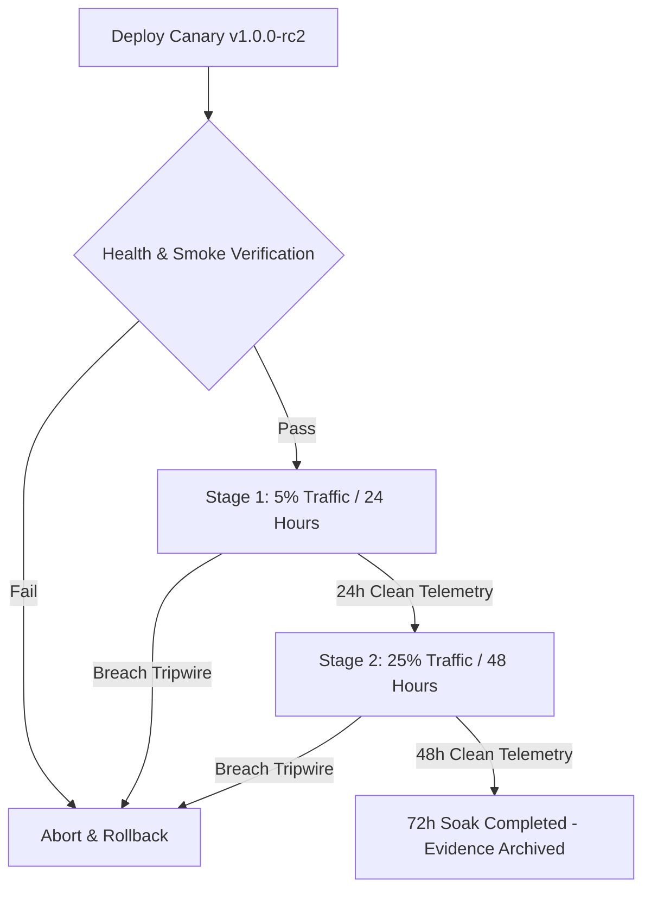

# SOAK-001: 72-Hour Staged Canary Observation & Soak Plan

**Document ID:** SOAK-001-PLAN-v1.0  
**Target Environment:** Production AWS Staging / Canary Cluster (`ap-south-1`)  
**Application:** Digital Impersonation Response Desk  
**Release Baseline:** `v1.0.0-controlled-pilot-rc2`  
**Current Assurance Status:** `BLOCKED` (Strictly dependent on `CLOUD-001`)  
**General Availability Gate:** Hard Blocker (GA strictly withheld until 72 hours of clean canary telemetry are completed)  

---

## 1. Objective & Governing Principles

This document establishes the operational and reliability specification for **SOAK-001 (72-Hour Staged Canary Soak)**.

General Availability (GA) cannot be certified purely through synthetic localhost benchmarks or short test suites. Enterprise SaaS systems operating in the cybersecurity and legal takedown domain must demonstrate zero operational regressions, zero memory degradation, zero unhandled errors, and flawless multi-worker scheduling under sustained multi-day execution.

### Governing Principles:
1. **No Time Compression:** The 72-hour duration is continuous physical clock time. No synthetic acceleration, simulation, or backdating is permitted.
2. **Deterministic Stages:** Traffic is promoted through strictly defined canary increments (Stage 1: 5% for 24h, Stage 2: 25% for 48h).
3. **Automated Tripwires:** Any critical SLI breach immediately aborts the canary, routes traffic to baseline, and resets the 72-hour timer to zero.
4. **Hardware-Backed Infrastructure:** Canary execution requires the real AWS production topology (`ap-south-1`, S3 Object Lock, KMS CMK). It cannot run on ephemeral local scratch disks.

---

## 2. Canary Staging Progression



### Stage 1: Initial Canary (5% Traffic / 24 Hours)
* **Traffic Allocation:** 5% of incoming tenant traffic routed to canary ECS tasks via ALB Weighted Target Groups.
* **Duration:** 24 continuous hours.
* **Focus:** Early crash detection, container startup integrity, cold-start latency, initial connection pooling to SQLite/EFS and S3.

### Stage 2: Expanded Canary (25% Traffic / 48 Hours)
* **Traffic Allocation:** 25% of incoming tenant traffic.
* **Duration:** 48 continuous hours.
* **Focus:** Sustained heap stability, SQLite WAL checkpointing under write load, background queue processing across 8 persistent workers, HMAC download token validation, rate-limiter consistency.

---

## 3. Service Level Indicators (SLIs) & Pass/Fail Criteria

| Metric | Measurement Method | Target SLA | Tripwire (Auto-Abort) |
|---|---|---|---|
| **HTTP Error Rate** | Prometheus / CloudWatch (5xx count / total requests) | `< 0.01%` | `> 0.1%` over 5-minute rolling window |
| **API Latency (P99)** | Express middleware latency timer across all routes | `< 500ms` | `> 1500ms` over 15-minute window |
| **API Latency (P50)** | Express middleware latency timer | `< 25ms` | `> 100ms` over 15-minute window |
| **Node.js Heap Growth** | `process.memoryUsage().heapUsed` sampled every 60s | `< 10%` net increase post-warmup | Unbounded monotonic climb over 4h |
| **Worker Health** | Periodic heartbeat check across 8 background workers | `100%` uptime (8/8 alive) | Any worker crash or deadlock |
| **Database Locks** | SQLite `busy_timeout` exceptions | `0` timeouts | `> 0` unhandled lock errors |
| **Evidence Custody** | SHA-256 validation on retrieve vs manifest | `100%` match | Any SHA-256 integrity mismatch |
| **Security Exceptions** | Uncaught exceptions / Unhandled promise rejections | `0` | Any uncaught exception |

---

## 4. Tripwire & Rollback Architecture

### 4.1 Automated Canary Tripwires
The AWS Application Load Balancer and CloudWatch Alarm triggers automate instant containment:
1. **ALB Alarm:** `HTTPCode_Target_5XX_Count > 5` within 5 minutes.
2. **Task Health Alarm:** ECS Target Unhealthy count `> 0`.
3. **Application Alarm:** CloudWatch metric filter on `[ERROR] UnhandledRejection` or `[CRITICAL] KillSwitchTrip`.

### 4.2 Rollback Action
Upon tripwire activation:
1. ALB target group weight for canary set immediately to `0%`.
2. 100% traffic falls back to existing stable baseline.
3. Diagnostic snapshot of canary container memory dump and logs captured to forensic S3 prefix.
4. Canary tasks terminated.
5. 72-hour timer **RESETS TO ZERO**. Root-cause investigation required before restart.

---

## 5. Execution Prerequisites & Current Blocker

Execution of `SOAK-001` has the following prerequisite dependency graph:

```text
CLOUD-001 (Production AWS Infrastructure in ap-south-1)
   └── Deployment of ECS Canary Cluster & ALB Weighted Target Groups
          └── Initiation of 72-Hour Continuous Clock (SOAK-001)
```

### Current Status:
* **Prerequisite CLOUD-001:** `OPEN / PROVISIONING_PENDING`
* **Soak Execution:** `NOT_STARTED`
* **SOAK-001 Status:** **`BLOCKED`**
* **Impact on GA:** **`HARD_BLOCKER`** (General Availability cannot be granted until all 72 hours are verified without breaches).
