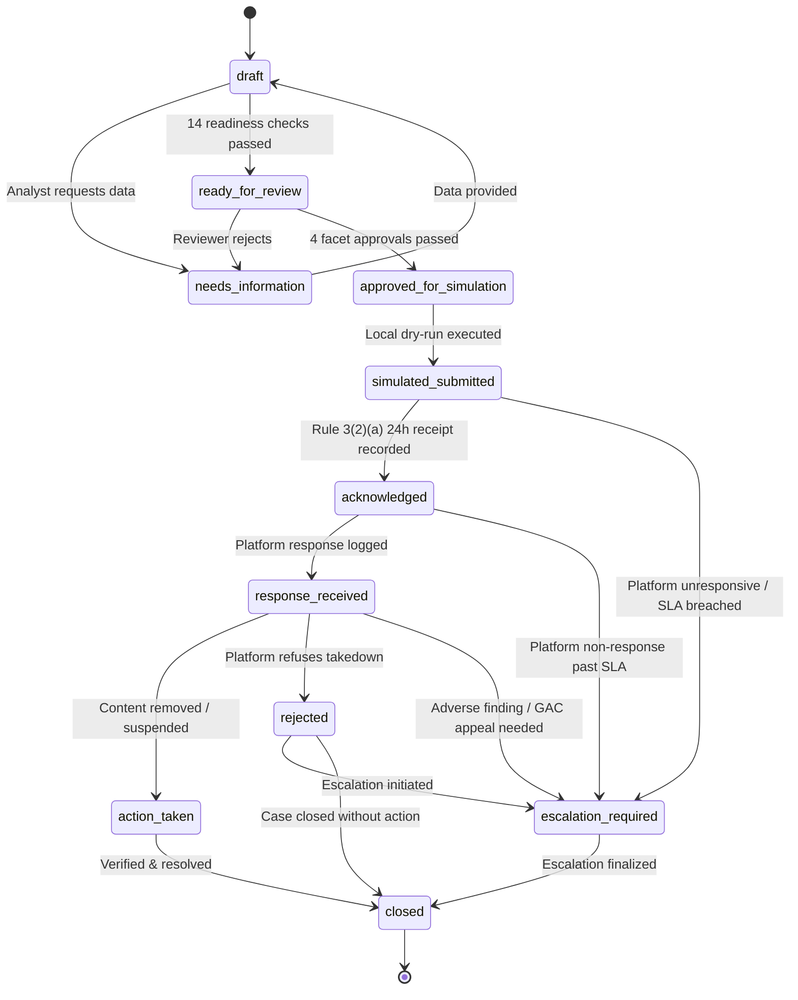

# Phase 4 Architecture: Platform Grievance Operations, Submission Control Plane, Escalation Tracking & Re-Upload Monitoring

## 1. Executive Summary & Design Principles

Phase 4 completes the incident operational lifecycle by extending the **Digital Impersonation Response Desk** from static dossier preparation to controlled, auditable, multi-stakeholder **grievance operations**.

### Strict Operational Principles:
1. **DRY-RUN / Simulation Safeguard**: Zero live HTTP requests to third-party social media platforms or grievance portals; zero mutations. All platform submissions pass exclusively through `LocalDryRunSubmissionAdapter`.
2. **Zero Contested URL Scraping / Crawling**: No outbound HTTP fetching, browser rendering, or scraping of external target URLs. Re-upload monitoring is strictly metadata-driven.
3. **Cryptographic Binding & Invalidation Detection**: Every submission draft binds a SHA-256 digest of the canonical submission packet. Any evidence mutation or dossier modification invalidates previous approvals and blocks simulation dispatch.
4. **Enforced Separation of Duties**: The incident or submission creator is strictly prohibited from approving the `legal_sufficiency` or `simulated_submission` facets. An independent reviewer is mandatory.
5. **Statutory-Source Discipline**: Every operational clock and notice grounds its authority in official Indian statutory frameworks (IT Act 2000, IT Rules 2021, BNS 2023), distinguishing mandatory legal deadlines from internal operational SLAs.

---

## 2. 11-Stage Grievance State Machine

Submissions progress through an audited 11-stage state machine defined in `src/domain/submission-state-machine.ts`:



### State Definitions & Guards:
- **`draft`**: Initial creation of submission for a specific platform and playbook.
- **`needs_information`**: Reviewer flagged missing documentation or insufficient forensic evidence.
- **`ready_for_review`**: All 14 automated case readiness checks have passed and packet is frozen.
- **`approved_for_simulation`**: All 4 facet approvals (`evidence_sufficiency`, `legal_sufficiency`, `platform_route_selection`, `simulated_submission`) have been recorded by authorized actors with separation of duties satisfied.
- **`simulated_submitted`**: Dry-run submission executed deterministically. Returns mock ticket ID `SIM-<PLATFORM>-<YEAR>-<HASH_PREFIX>`.
- **`acknowledged`**: Platform acknowledgement recorded (satisfies IT Rules 2021 Rule 3(2)(a) 24-hour statutory receipt).
- **`response_received`**: Intermediate platform response recorded (e.g. under review, more info requested).
- **`action_taken`**: Positive takedown outcome confirmed (e.g. content removed, account suspended).
- **`rejected`**: Platform explicitly refused takedown.
- **`escalation_required`**: Platform breach, non-response, or rejection flagged for GAC appeal, cybercrime filing, or High Court writ.
- **`closed`**: Terminal operational state.

---

## 3. Multi-Faceted Approval Matrix & Separation of Duties

To eliminate single-operator risk and comply with institutional legal governance, dispatching a platform grievance simulation requires four distinct sign-offs:

| Approval Facet | Permitted Roles | Separation of Duties Invariant |
| :--- | :--- | :--- |
| `evidence_sufficiency` | `analyst`, `case_manager`, `legal_reviewer`, `org_owner`, `system_admin` | Validates forensic hashes, file sizes, and non-quarantined status. |
| `legal_sufficiency` | `legal_reviewer`, `org_owner`, `system_admin` | **Creator cannot approve.** Confirms statutory grounds (IT Rules 2021 Rule 3(1)(b) / 3(2)(b)). |
| `platform_route_selection` | `case_manager`, `legal_reviewer`, `org_owner`, `system_admin` | Confirms designated officer channel, SLA, and notice format. |
| `simulated_submission` | `case_manager`, `legal_reviewer`, `org_owner`, `system_admin` | **Creator cannot approve.** Authorizes dispatch into simulation queue. |

### Cryptographic Packet Binding:
Each approval record stores `packet_hash_signed = SHA256(canonical_packet_json)`. If an operator uploads new evidence, alters the contested URL, or updates the case title after sign-off, the current generated packet hash will differ from `packet_hash_signed`. The state machine immediately halts with `HASH_MISMATCH` and triggers `TAMPER WARNING / HASH MISMATCH` in the UI.

---

## 4. Deterministic Local Dry-Run Adapter

All platform transmissions execute through `LocalDryRunSubmissionAdapter` (`src/domain/submission-adapter.ts`):

- **No Outbound Network Sockets**: The adapter makes zero `fetch`, `axios`, or socket calls.
- **Deterministic Reference Generation**:
  ```
  SIM-<UPPERCASE_PLATFORM>-<UTC_YEAR>-<FIRST_8_HEX_CHARS_OF_PACKET_HASH>
  ```
  Example: `SIM-INSTAGRAM-2026-9F3A1B2C`
- **Simulated Transmission Payload**: Records notice markdown, canonical JSON, simulated receipt timestamp, and transmission metadata directly into the database.

---

## 5. Versioned Platform Registry & Playbooks

The platform registry (`src/domain/types.ts` and `platform_registry` table) models the grievance architectures of major intermediaries operating in India:

1. **Meta (Instagram & Facebook)**: Indian Grievance Officer, Rule 3(2)(b) 24h intimate media priority channel, 36h general takedown SLA.
2. **Google (YouTube & Web Search)**: Indian Grievance Officer, Defamation & synthetic impersonation escalation forms.
3. **X (formerly Twitter)**: Grievance Officer India, impersonation & synthetic media portal.
4. **Telegram**: Grievance Officer India, channel impersonation notice desk.
5. **WhatsApp**: Grievance Officer India, impersonation / fraudulent group reporting.
6. **LinkedIn**: Professional identity theft & likeness impersonation grievance desk.

### Playbook System:
Playbooks specify:
- Statutory basis references (e.g. IT Act § 66D, Rule 3(1)(b)(v), BNS § 318(4)).
- SLA response times (24h for intimate imagery, 36h for court/govt orders, 72h for general impersonation).
- Target entity type matching.
- Escalation escalation routes (GAC, NCRP 1930, MeitY 69A, High Court writ).

---

## 6. Metadata-Only Re-Upload & Mirror Monitoring

The re-upload monitoring subsystem (`src/services/reupload-monitoring-service.ts`):

- **Strictly Passive & Non-Intrusive**: No scraping, crawling, or automated network fetching of contested URLs.
- **URL Normalization**: Automatically strips tracking query parameters (`utm_source`, `utm_medium`, `fbclid`, `igsh`, `ref`, etc.) to prevent duplicate fragmentation.
- **Relationship Taxonomies**:
  - `exact_reupload`: Byte or audio-visual mirror clone.
  - `modified_reupload`: Cropped, watermarked, or edited mirror.
  - `same_actor_new_channel`: Syndicated handle impersonating the same target entity.
  - `syndicated_cross_platform`: Mirror posted across disparate platforms.
  - `unrelated`: Operator-verified false positive.
- **Lifecycle Tracking**: `investigating` &rarr; `confirmed_infringing` &rarr; `removed`.

---

## 7. Escalation Tracking Subsystem

When platforms fail to acknowledge within 24 hours (IT Rules 2021 Rule 3(2)(a)), exceed the 36-hour takedown deadline (Rule 3(2)(b)), or improperly reject valid grievances, the desk facilitates formal legal escalations (`src/services/escalation-service.ts`):

- **Severity Tiers**: `standard`, `urgent`, `critical_statutory`.
- **Target Forums**:
  - **Grievance Appellate Committee (GAC)**: Statutory appeal against intermediary decision within 30 days under Rule 3A.
  - **National Cybercrime Reporting Portal (NCRP / 1930)**: Criminal fraud / deepfake extortion under BNS §§ 318, 319.
  - **MeitY Section 69A Referral**: Emergency government blocking order for public interest / national security harms.
  - **High Court Writ Petition**: Interim mandatory injunction against intermediaries for safe-harbor forfeiture under Section 79.
- **Resolution Tracking**: Full audit trail of legal notice numbers, forum case numbers, and final outcomes.
