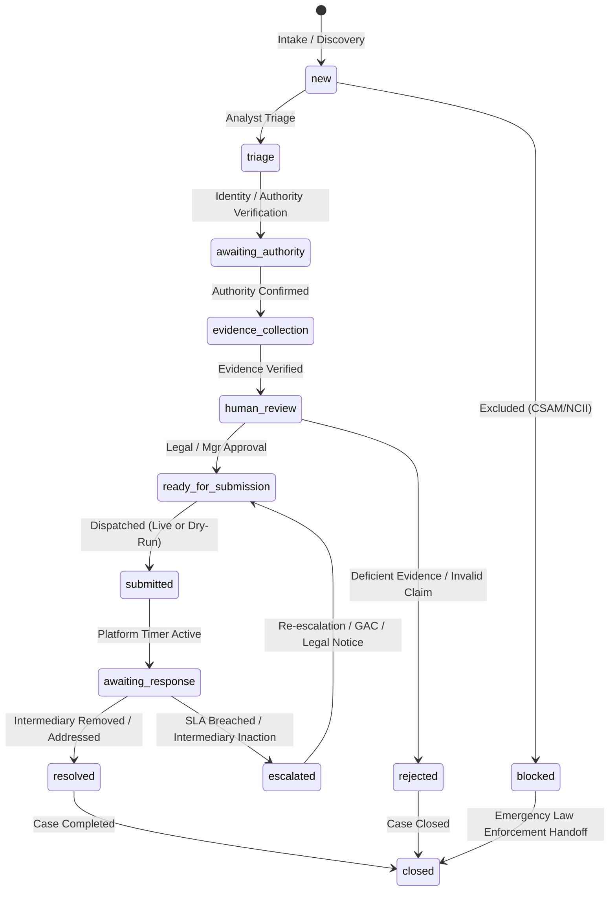

# Digital Impersonation Response Desk: Product Overview

## 1. Executive Summary
**Digital Impersonation Response Desk** is an India-first Software-as-a-Service (SaaS) platform engineered for brands, healthcare professionals, founders, creators, public agencies, and public-facing professionals. The platform orchestrates the discovery, evidence preservation, legal and policy classification, human-verified response routing, notice drafting, and platform escalation of online impersonation and synthetic-media (deepfake) incidents.

The system enforces strict **Human-In-The-Loop (HITL)** governance, tamper-evident evidence custody, and India-specific regulatory compliance while maintaining an uncompromised posture of ethical safety.

---

## 2. Core Operational Principles & Safety Invariants

### 2.1 What the Product DOES NOT Do (Explicit Non-Goals & Safety Safeguards)
1. **No Removal Guarantees**: The product assists in structured, legally grounded escalation; it never promises or guarantees removal, which remains the sole prerogative of intermediaries, hosting providers, and judicial authorities.
2. **No Autonomous Criminal Accusations**: The platform never automatically accuses individuals or entities of crimes or issues automated defamatory allegations.
3. **Strict Exclusion of CSAM and NCII**:
   - The platform **does not process, store, or display** Child Sexual Abuse Material (CSAM) or Non-Consensual Intimate Imagery (NCII).
   - Any suspected case immediately halts normal processing, limits previews, preserves a minimal emergency metadata event, and routes the operator to authorized law enforcement (NCRP / cybercrime.gov.in / 1930 / specialist authorities).
4. **No Irreversible Autonomous External Actions**: Every external notice, email, API call, or grievance filing requires explicit human approval from an authorized case manager or legal reviewer.
5. **No AI Detector Legal Proof**: Synthetic media detector outputs are treated strictly as probabilistic advisory signals—never as judicial or legal proof.

---

## 3. User Roles and Access Hierarchy
The platform implements granular Role-Based Access Control (RBAC) scoped strictly per tenant organization:

| Role | Responsibilities | Key Permissions |
| :--- | :--- | :--- |
| **System Administrator** | Platform infrastructure, tenant provisioning, system health. | Cross-tenant diagnostic metrics (no evidence access), system config. |
| **Organization Owner** | Account owner, billing, tenant governance, authorized contacts. | Full organization access, workspace settings, role assignments. |
| **Organization Administrator** | Workspace management, team member invites, policy review settings. | Manage users, configure notification channels, view all org cases. |
| **Case Manager** | Operational incident management, triage, assignment, workflow coordination. | Create, edit, assign, advance case state, manage evidence. |
| **Analyst** | Evidence capture, OSINT research, signal collection, notice drafting. | Upload evidence, draft notices, run detector adapters. |
| **Legal Reviewer** | Legal qualification, authority validation, notice approval, grievance filing. | Approve/reject legal notices, sign off on platform submissions. |
| **Read-Only Customer Stakeholder** | Client executive, affected brand/creator representative. | View status dashboard, case progress, approve authority declarations. |

---

## 4. Initial Supported Incident Categories

1. **Fake Social Profile**: Unauthorized accounts mimicking an executive, doctor, celebrity, or brand handle.
2. **Brand Impersonation**: Cloned logos, fraudulent customer-support handles, counterfeit storefronts.
3. **Founder / Doctor / Creator Impersonation**: High-trust identity theft (e.g., unauthorized medical advice, fraudulent financial advice).
4. **Synthetic Audio or Video Endorsement**: Deepfake video or cloned voice endorsing investments, fake schemes, or unapproved medical products.
5. **Scam Advertisement**: Paid ads on social networks impersonating brands/influencers leading to phishing/malware.
6. **Look-Alike Domain**: Typosquatting, homoglyph domains, phishing landing pages copying corporate identity.
7. **Fake Support Account**: Impersonation of official customer support channels on WhatsApp, Telegram, or X.
8. **Copyright / Trademark Misuse**: Unauthorized re-upload of proprietary media, brand assets, or protected marks.
9. **Privacy or Likeness Complaint**: Misappropriation of personal likeness, voice, or private identity attributes.
10. **Defamation / Legal Escalation**: High-severity malicious smear campaigns requiring advocate/counsel escalation.

*Note*: Categories 4, 8, 9, and 10 require mandatory sign-off by a **Legal Reviewer** before any notice can be cleared for dispatch.

---

## 5. India-Specific Regulatory & Legal Grounding
The platform's classification engine maps incidents directly to Indian statutes and intermediary regulations:
- **Information Technology Act, 2000**:
  - *Section 66C*: Identity theft (stealing electronic signature, password, unique identification feature).
  - *Section 66D*: Cheating by personation using computer resource.
  - *Section 66E*: Violation of bodily privacy (intentional capture/publication without consent).
  - *Section 79*: Intermediary guidelines and statutory due diligence.
- **IT (Intermediary Guidelines and Digital Media Ethics Code) Rules, 2021**:
  - *Rule 3(1)(b)*: Obligation of intermediaries not to host impersonating, defamatory, or misleading synthetic content.
  - *Rule 3(2)(b)*: Strict **24-hour** takedown mandate for non-consensual sexual/impersonation content from receipt of grievance; **72-hour** resolution window for general grievances.
  - *Resident Grievance Officer (RGO)* statutory escalation pathways.
  - *Grievance Appellate Committee (GAC)* appeals mechanism.
- **Bharatiya Nyaya Sanhita (BNS), 2023**:
  - *Section 318 / 319*: Cheating and cheating by personation.
  - *Section 336*: Forgery for the purpose of harming reputation.
  - *Section 356*: Defamation.
- **Copyright Act, 1957 (Sections 51, 52)** & **Trade Marks Act, 1999** (Passing off & Infringement).
- **Digital Personal Data Protection (DPDP) Act, 2023**: Strict data minimization, lawful processing of identity proofs, right to correction/erasure.
- **CERT-In Directions (2022)**: Cybersecurity incident reporting protocols under Rule 12.
- **Law Enforcement Coordination**: Guidance for reporting via NCRP (National Cyber Crime Reporting Portal - `cybercrime.gov.in`) and National Cyber Helpline `1930`.

---

## 6. Case Lifecycle State Machine
Every case transitions through deterministic, auditable states:

---

## 7. Evidence & Chain of Custody Invariants
- **Originals Isolated**: Raw binary uploads are held in immutable, isolated storage with SHA-256 integrity checks.
- **Working Copies Redacted**: Publicly viewable or operational copies redact third-party PII.
- **No Direct Storage URLs**: Assets are accessed exclusively via short-lived, cryptographically signed URLs.
- **Tamper-Evident Audit Logging**: Every view, download, classification change, and notice modification generates an immutable audit record containing tenant ID, user ID, client IP, action, timestamp, and metadata diff.
