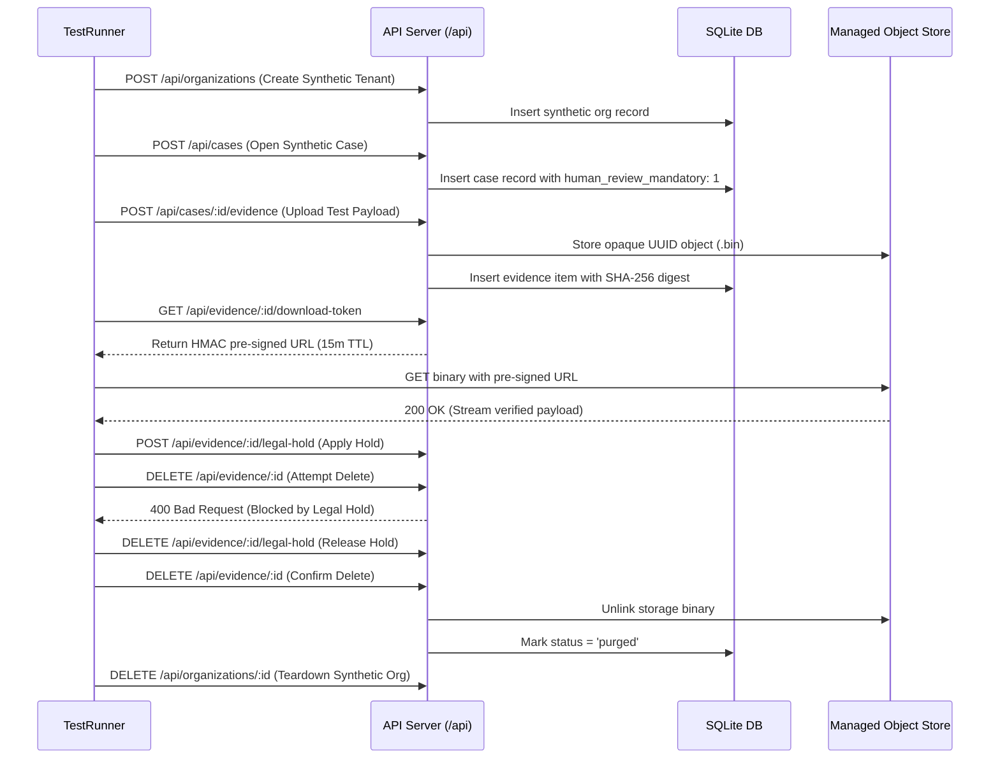

# Controlled Production Canary & Staged Rollout Protocol

**Document Version:** 1.0.0  
**Target Environment:** Digital Impersonation Response Desk (Staging / Production Canary)  
**Author:** Platform Reliability & Release Engineering  
**Approved By:** Security & Operations Board  

---

## 1. Overview & Phased Rollout Strategy

To safeguard operational stability, tenant isolation, and regulatory compliance, all software updates to the **Digital Impersonation Response Desk** follow a strict **4-Stage Controlled Canary Protocol**. 

No build is promoted directly to 100% production traffic without passing explicit health gates and automated synthetic verification probes.

```mermaid
graph TD
    Build[Validated Release Image (Docker)] --> S0[Stage 0: Pre-Flight & Synthetic Probe (0% Traffic)]
    S0 -->|Pass Gate 0| S1[Stage 1: Internal Canary (5% Traffic / Internal Tenant)]
    S1 -->|Pass Gate 1 (24h Soak)| S2[Stage 2: Pilot Expansion (25% Traffic / Consenting Tenants)]
    S2 -->|Pass Gate 2 (48h Soak)| S3[Stage 3: Full General Availability (100% Traffic)]
    
    S0 -.->|Failure| Rollback[Automated Rollback to Blue Stable]
    S1 -.->|Failure| Rollback
    S2 -.->|Failure| Rollback
```

---

## 2. Canary Stages & Progression Criteria

### 2.1 Stage 0: Pre-Flight Verification & Synthetic Probe (0% External Traffic)
* **Objective:** Verify container startup, database migration status, and storage connectivity in isolation prior to routing any live traffic.
* **Duration:** 10 minutes.
* **Traffic:** 0% external traffic. All requests originate from automated synthetic health probes.
* **Verification Checks:**
  1. `GET /healthz/live` returns HTTP 200 `{ status: 'alive' }`.
  2. `GET /healthz/ready` returns HTTP 200 with `pendingMigrations: 0` and `database.healthy: true`.
  3. `GET /healthz/dependencies` returns HTTP 200 with `evidenceAccessible: true` and `backupsAccessible: true`.
  4. Execute automated synthetic tenant lifecycle probe (see Section 3).
* **Gate 0 Pass Criteria:** 100% pass on synthetic tenant probe; zero unhandled errors.

---

### 2.2 Stage 1: Internal Canary (5% Traffic / Single Internal Pilot Tenant)
* **Objective:** Evaluate real runtime workloads under controlled conditions using internal company test accounts.
* **Duration:** 24-hour soak period.
* **Traffic Allocation:** 5% of incoming traffic or traffic specifically routed via header `X-Canary-Eligible: true`.
* **Telemetry Monitoring:**
  - Prometheus metrics scraped every 15 seconds via `/metrics?format=prometheus`.
  - Structured logs monitored for `error` level events.
* **Gate 1 Pass Criteria:**
  - HTTP 5xx error rate < 0.01%.
  - HTTP request duration P95 < 150ms, P99 < 400ms.
  - Database ping latency < 15ms.
  - Zero circuit breaker trips on read-only external provider integrations.
  - Zero worker fleet restarts or stale heartbeats.

---

### 2.3 Stage 2: Controlled Pilot Tenant Expansion (25% Traffic)
* **Objective:** Expand workload to consenting pilot organizations participating in the controlled evaluation program.
* **Duration:** 48-hour soak period.
* **Traffic Allocation:** 25% of total cluster capacity.
* **Operational Guards:**
  - `PILOT_MODE=true` remains strictly enforced.
  - `ENABLE_LIVE_PLATFORM_ACTIONS=false` strictly enforced (no automated platform takedowns).
  - Rate limiting active on all API endpoints.
* **Gate 2 Pass Criteria:**
  - Zero cross-tenant isolation warnings in audit logs.
  - Two-person evidence deletion workflows verified end-to-end.
  - Zero unaccounted memory growth in application containers.

---

### 2.4 Stage 3: Full Production Promotion (100% Traffic)
* **Objective:** Shift 100% of production traffic to the new release build.
* **Procedure:**
  - Update reverse proxy routing weight: Blue = 0%, Green = 100%.
  - Blue (previous release) remains running in standby mode for 2 hours to enable instant rollback if delayed anomalies emerge.
  - After 2 hours of verified stability, Blue containers are gracefully drained and stopped.

---

## 3. Automated Synthetic Tenant Verification Playbook

During Stage 0, the continuous integration pipeline executes an end-to-end synthetic tenant script to validate core application functionality:



---

## 4. Automated Rollback Protocol & Tripwires

Any of the following automated triggers will immediately abort the canary rollout and revert 100% of traffic back to the stable Blue deployment:

| Trigger Condition | Threshold | Action |
|---|---|---|
| **HTTP 5xx Server Error Rate** | > 0.5% over a 3-minute sliding window | **Instant Automated Rollback** |
| **Database Latency Spike** | P95 > 250ms for 2 consecutive minutes | **Instant Automated Rollback** |
| **Worker Heartbeat Stoppage** | Any background worker stale > 3 intervals | **Incident Alert & Rollback** |
| **Circuit Breaker Anomaly** | Unexpected trip to `open` state during canary | **Traffic Hold & Rollback** |
| **Pending Migration Mismatch** | `/healthz/ready` reports `pendingCount > 0` | **Hard Deployment Abort** |
| **Tenant Isolation Alert** | Single cross-tenant authorization failure | **Emergency Rollback & Incident Escalation** |

### Rollback Execution Command:
```bash
# SRE Emergency Single-Command Rollback
curl -X POST http://reverse-proxy.internal/canary/abort \
     -H "Authorization: Bearer $RELEASE_ADMIN_KEY" \
     -d '{"reason": "Canary threshold breached", "action": "revert_blue_100"}'
```
