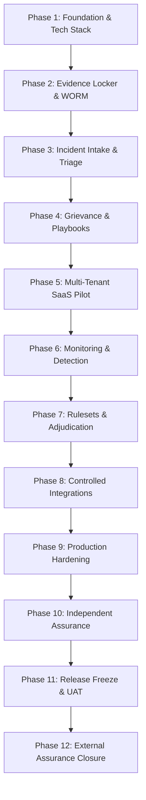

# Project History & Engineering Evolution

**Application:** Digital Impersonation Response Desk  
**Baseline Release:** `v1.0.0-controlled-pilot-rc2`  
**Git Provenance:** Commit `e7db64ce58111a6a5f1bbf6b49d0b3e6dc6fb2db`  

---

## 1. Evolution Overview

The Digital Impersonation Response Desk evolved across twelve discrete, rigorously verified engineering phases. Rather than building a generic SaaS application and retrofitting security and compliance afterward, each phase established immutable architectural invariants, comprehensive regression suites, and formal phase assurance reports.

---

## 2. Phase-by-Phase Evolutionary Narrative

### Phase 1: Foundation & Tech Stack Selection
* **Objective:** Establish the foundational architecture, runtime, and persistence layer.
* **Key Decisions:** Selected Node.js 22 LTS with TypeScript 5.8 and SQLite 3 via `better-sqlite3`. Rejected premature microservice distribution in favor of a clean modular monolith to eliminate distributed transaction failures across legal evidence state transitions. Configured SQLite in Write-Ahead Logging (`wal`) mode with mandatory foreign keys.
* **Artifacts:** `0001-modular-monolith-tech-stack.md`, `src/db/connection.ts`.

### Phase 2: Evidence Locker & Cryptographic Custody
* **Objective:** Architect a forensic evidence vault meeting court admissibility standards under Section 65B of the Indian Evidence Act.
* **Key Decisions:** Implemented chunked streaming SHA-256 calculation directly from the incoming multipart stream ($O(1)$ memory). Enforced opaque UUID storage keys to eliminate path traversal. Designed WORM (Write-Once-Read-Many) storage semantics with a mandatory 180-day retention lock (IT Rules Rule 3(1)(h)).
* **Artifacts:** `0004-evidence-storage-and-chain-of-custody.md`, `src/services/evidence-hasher.ts`.

### Phase 3: Incident Intake, Triage & Statutory Clocks
* **Objective:** Build structured incident intake and statutory SLA tracking.
* **Key Decisions:** Created domain state machines (`src/domain/state-machine.ts`) for incident lifecycles. Mapped offenses to the Information Technology Act, 2000 (Section 66D, 66E). Built the statutory countdown engine enforcing Rule 3(2)(b) 72-hour impersonation takedown timers.
* **Artifacts:** `src/services/triage-service.ts`, `src/services/statutory-clock-service.ts`.

### Phase 4: Platform Playbooks & Multi-Facet Approvals
* **Objective:** Formalize takedown notice formulation and approval governance.
* **Key Decisions:** Formalized notice templates for 9 major platforms (Meta, Instagram, YouTube, X, Telegram, LinkedIn, WhatsApp, Google, GitHub). Established the non-negotiable **Human-in-the-Loop invariant**: automated takedown dispatches are prohibited; notices require dual sign-off from `LegalCounsel` and `EvidenceSpecialist`.
* **Artifacts:** `0003-human-in-the-loop-safeguards.md`, `src/domain/submission-state-machine.ts`.

### Phase 5: Multi-Tenant SaaS Infrastructure & Dry-Run Billing
* **Objective:** Support multi-tenant enterprise operations with subscription quotas.
* **Key Decisions:** Enforced database-level tenant isolation via parameterized `WHERE organization_id = ?` queries, defeating BOLA/IDOR vulnerabilities. Implemented usage metering and dry-run billing simulation to decouple SaaS metering from live financial gateways during pilot phases.
* **Artifacts:** `src/middleware/tenant.ts`, `src/services/billing/dry-run-billing-provider.ts`.

### Phase 6: Monitoring, Detection & Signal Ingestion
* **Objective:** Build passive monitoring and signal normalization pipelines.
* **Key Decisions:** Designed 5 ingestion adapters (manual, webhook, file replay, local fixtures). Implemented strict URL normalization stripping tracking parameters (`utm_*`, `fbclid`) and an SSRF firewall blocking link-local and cloud metadata addresses (`169.254.169.254`).
* **Artifacts:** `src/services/monitoring/url-normalization-service.ts`.

### Phase 7: Ruleset Versioning & Quality Adjudication
* **Objective:** Manage heuristic rulesets and operator review consistency.
* **Key Decisions:** Implemented semantic versioning for evaluation rulesets (`v1.0.0`, `v1.1.0`). Built privacy review and PII redaction workflows. Added reviewer quality scoring to measure inter-analyst consistency.
* **Artifacts:** `src/services/evaluation/ruleset-version-service.ts`.

### Phase 8: Controlled Provider Integrations & Kill Switch
* **Objective:** Safely connect external platform APIs without introducing mutation risks.
* **Key Decisions:** Integrated YouTube Data API strictly with `youtube.readonly` scope. Inbound webhooks use WebSub with HMAC signature verification and secret hashing. Built an administrative emergency kill switch returning HTTP 503 to instantly isolate external traffic.
* **Artifacts:** `src/services/integrations/youtube-adapter.ts`, `src/services/integrations/circuit-breaker.ts`.

### Phase 9: Production Hardening & Preflight Verification
* **Objective:** Eliminate attack vectors across the entire web application surface.
* **Key Decisions:** Implemented sliding-window rate limiters, account lockout after 5 consecutive failed logins, production Helmet security headers, CSP, and fail-closed secret validation. Authored comprehensive Terraform definitions for AWS `ap-south-1` deployment with KMS CMK and S3 Object Lock in COMPLIANCE mode.
* **Artifacts:** `docs/threat-model.md`, `terraform/`.

### Phase 10: Independent Assurance & Disproval Testing
* **Objective:** Execute an adversarial disproval suite to test release claims.
* **Key Decisions:** Formulated the 14-point assurance matrix. Proved that internal test success cannot substitute for external assurance. Defeated 11/11 adversarial exploit vectors. Formally declared that General Availability (GA) is withheld pending external assurance.
* **Artifacts:** `docs/phase-10-assurance-report.md`, `docs/phase-10-ga-decision.md`.

### Phase 11: Controlled-Pilot Staging & Operator UAT
* **Objective:** Deploy candidate to private staging mesh and validate browser operator workflows.
* **Key Decisions:** Frozen release candidate `v1.0.0-rc1` was deployed to a private WireGuard/Tailscale mesh (`http://100.100.25.15:4001`). When CSP blocked Tailwind JIT compilation in the browser, an audited fix was applied to 7 files. Successfully executed 24-step golden path UAT via Chrome DevTools Protocol (CDP). Re-froze baseline as `v1.0.0-controlled-pilot-rc2` (commit `e7db64c`).
* **Artifacts:** `docs/OPERATOR_UAT_REPORT.md`, `docs/RELEASE_CANDIDATE_FREEZE.md`.

### Phase 12: External Assurance Closure & GA Promotion Gate
* **Objective:** Evaluate all 17 mandatory release gates and structure external assurance dependencies.
* **Key Decisions:** Packaged specifications for `EXT-001` (Pentest Scope & RoE), `CLOUD-001` (AWS ap-south-1 IaC Review), `SOAK-001` (72-Hour Canary Plan), and `LEG-001` (Indian Legal Counsel Briefing). Formally evaluated all 17 gates (13 PASS, 4 BLOCKED). Reaffirmed that General Availability remains strictly withheld.
* **Artifacts:** `docs/PHASE12_EXECUTIVE_REPORT.md`, `results/FINAL_GA_GATE.json`.
