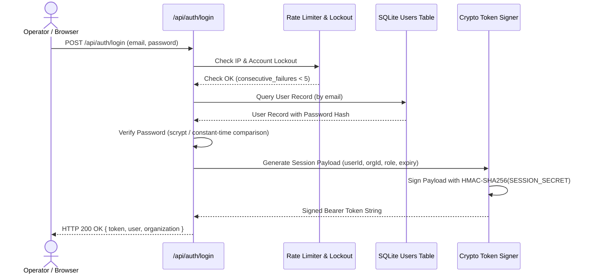

# Authentication & Session Hardening Specification

**Application:** Digital Impersonation Response Desk  
**Baseline Release:** `v1.0.0-controlled-pilot-rc2`  

---

## 1. Authentication Architecture

The application implements a stateless, cryptographically signed Bearer session token architecture designed for high-security multi-tenant access control without server-side session bloat:



---

## 2. Cryptographic Session Tokens

### 2.1 Token Structure
Tokens follow a base64url-encoded two-part format: `payload.signature`
* **Payload:**
  ```json
  {
    "userId": "usr_apex_mgr_02",
    "organizationId": "org_apex_health_01",
    "role": "CaseManager",
    "iat": 1726580000,
    "exp": 1726608800
  }
  ```
* **Signature:**
  `HMAC-SHA256(payloadB64, SESSION_SECRET)` encoded as `base64url`.

### 2.2 Verification Invariants (`src/middleware/auth.ts`)
1. **Signature Integrity:** The middleware computes the expected HMAC using `crypto.timingSafeEqual` to prevent timing attacks. Any alteration of `userId`, `role`, or `organizationId` results in instant signature mismatch and `HTTP 401 Unauthorized`.
2. **Expiration Enforcement:** Expired tokens (`Date.now() > exp * 1000`) are rejected immediately with `HTTP 401 Unauthorized: TOKEN_EXPIRED`.
3. **Strict Rejection of Header-Based Authentication:** In production mode (`NODE_ENV=production`), legacy development header auth (`x-user-id`, `x-org-id`) is completely disabled. Any request lacking a valid Bearer token is rejected.

---

## 3. Brute-Force & Credential Stuffing Defenses

### 3.1 Rate Limiting (`src/security/rate-limiter.ts`)
* Sliding-window in-memory rate limiter tracking client IP addresses.
* Sensitive endpoints (`/api/auth/login`, `/api/auth/register`) are restricted to **5 requests per minute per IP**.
* Rate limit breaches return **`HTTP 429 Too Many Requests`** with a `Retry-After` header.

### 3.2 Account Lockout (`src/security/account-lockout.ts`)
* Tracks consecutive failed login attempts per user account.
* **Lockout Policy:**
  - 5 consecutive failed passwords = account locked for **15 minutes**.
  - Lockout resets upon successful authenticated login.
  - Returns `HTTP 423 Locked: ACCOUNT_TEMPORARILY_LOCKED`.

---

## 4. Automated Verification

Authentication hardening is verified across multiple automated test suites:
* `tests/security/auth-hardening.test.ts`: Validates token signature forgery rejection, expired token rejection, and header-based auth rejection in production mode.
* `tests/security/production-hardening.test.ts`: Validates rate limiter tripping and account lockout behavior.
* `tests/security/independent-verification.test.ts`: Verifies rejection of tampered tokens with manipulated roles (e.g. attempting to elevate from Analyst to SystemAdmin).
