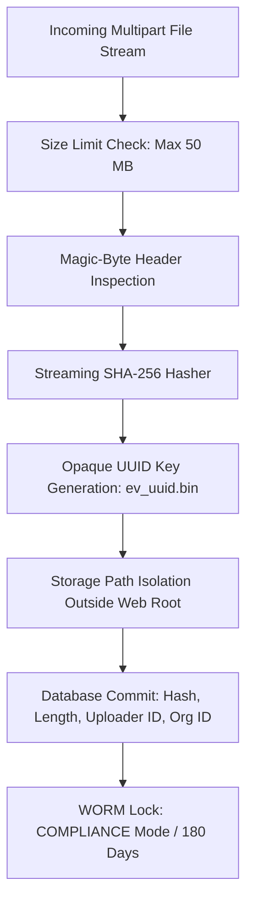

# Forensic Evidence Security & Storage Controls

**Application:** Digital Impersonation Response Desk  
**Baseline Release:** `v1.0.0-controlled-pilot-rc2`  

---

## 1. Threat Profile for Forensic Storage

Evidence storage handles high-risk content: victim screenshots, deepfake media files, extortion correspondence, and legal affidavits. The security controls must prevent:
1. **Evidence Tampering:** Modification of evidence files post-capture.
2. **Malicious File Ingestion:** Exploitation of the server via malicious executables, polyglot files, or zip bombs.
3. **Path Traversal / Arbitrary File Overwrite:** Uploading files targeting paths such as `../../etc/passwd`.
4. **Premature Deletion:** Deleting critical evidence to hinder investigations.
5. **Unauthorized Exfiltration:** Downloading evidence files without authenticated authorization.

---

## 2. Multi-Layer Storage Defenses



### 2.1 Streaming Hasher & Ingestion Sanitization
* **Streaming Hash Generation:** As bytes stream into `src/services/evidence-hasher.ts`, a chunked SHA-256 digest is updated in memory.
* **Magic-Byte Allowlist:** Rejects executables, scripts, or disguised archives. Only valid `JPEG`, `PNG`, `MP4`, and `PDF` byte headers are accepted.
* **Stream Bounds:** Any stream exceeding 50 MB triggers immediate socket destruction and `HTTP 413 Payload Too Large`.

### 2.2 Storage Sandboxing & Path Traversal Prevention
* Files are never stored using user-supplied names.
* All storage paths are computed using strictly generated UUID v4 keys:
  ```typescript
  const storageKey = `ev_${crypto.randomUUID()}.bin`;
  const sanitizedPath = path.resolve(storageDir, storageKey);
  if (!sanitizedPath.startsWith(storageDir)) {
    throw new SecurityError('Path traversal attempt detected');
  }
  ```
* Sandboxing verified in `tests/storage/evidence-storage.test.ts`.

### 2.3 Download Token Gate
* Direct filesystem or bucket downloads are strictly forbidden.
* Downloading an evidence object requires requesting a short-lived HMAC download token (`300 seconds TTL`).
* The download handler parses the token, checks signature validity, confirms the requesting user's tenant matches the evidence object's tenant, and streams the file.

### 2.4 WORM Retention & Legal Holds
* **WORM Compliance:** Minimum 180-day retention lock per Rule 3(1)(h) of the IT Rules 2021.
* **Legal Hold Override:** Evidence under active legal hold cannot be deleted; attempts return `HTTP 409 Conflict`.
* **Two-Person Deletion Workflow:** Requires dual independent authorization from distinct operators before unheld, expired evidence can be expunged.
