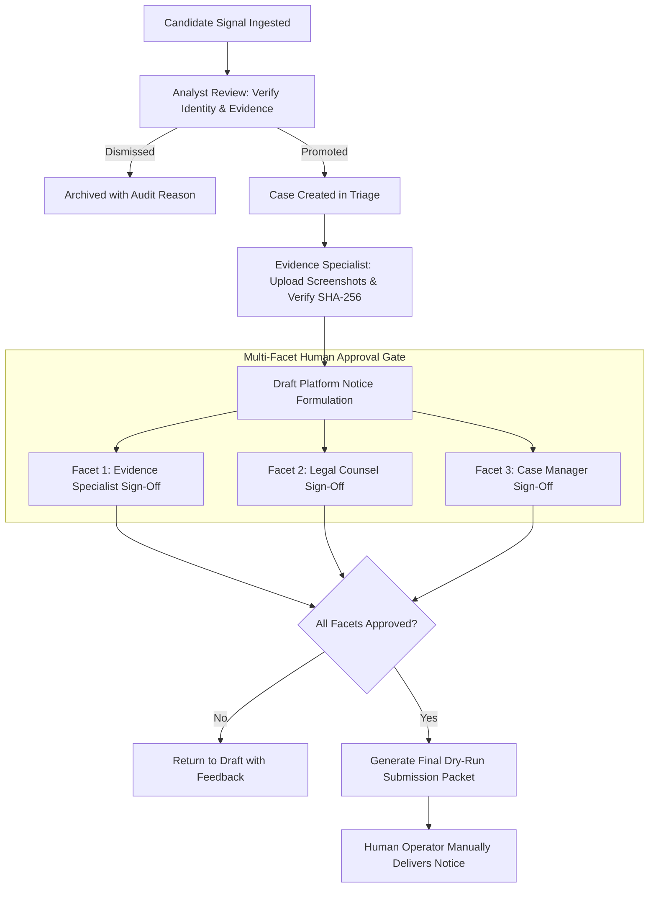

# Human-in-the-Loop Safety Invariants & Approval Boundaries

**Application:** Digital Impersonation Response Desk  
**Specification ID:** SEC-HITL-INVARIANTS-v1.0  
**Baseline Release:** `v1.0.0-controlled-pilot-rc2`  
**Core Posture:** Strictly Human-Supervised • Zero Autonomous Harm  

---

## 1. The Core Safety Invariant

> **The Digital Impersonation Response Desk never executes autonomous accusations, autonomous takedowns, or autonomous legal determinations.**  
> Every external grievance packet, notice dispatch, and evidence classification requires explicit, authenticated human operator review and multi-role sign-off.

In the domain of cyber impersonation, deepfakes, and copyright takedowns, automated systems that act without human supervision introduce severe risks:
* False-positive censorship of legitimate parody, critique, or public reporting.
* Defamation liability under Section 499/500 of the Indian Penal Code / Bharatiya Nyaya Sanhita (BNS).
* Loss of intermediary safe harbor protection under Section 79 of the Information Technology Act, 2000.
* Retaliatory counter-claims for tortious interference with business relations.

The Response Desk is intentionally engineered as an **intelligence and workflow accelerator for human experts**, not an autonomous agent.

---

## 2. What the System Will NEVER Do Autonomously

The codebase contains hardcoded architectural invariants guaranteeing that the software will **never** perform the following actions without human authorization:

| Autonomous Action | System Stance | Architectural Guarantee |
|---|---|---|
| **Declare Content Illegal** | **STRICTLY PROHIBITED** | Legal assessment requires explicit sign-off from verified `LegalCounsel` role |
| **Declare Content Defamatory** | **STRICTLY PROHIBITED** | Defamation scoring is an advisory signal score; never auto-committed |
| **Declare Content Fake / Deepfake** | **STRICTLY PROHIBITED** | Synthetic media detection outputs confidence intervals; requires analyst confirmation |
| **Execute Platform Takedowns** | **STRICTLY PROHIBITED** | `ENABLE_LIVE_PLATFORM_ACTIONS=false`; notices formulate in `draft` mode |
| **Send Private Communications** | **STRICTLY PROHIBITED** | Zero direct messaging or victim contact without case manager action |
| **Make Autonomous Accusations** | **STRICTLY PROHIBITED** | Complaint dossiers require explicit complainant signature binding |
| **Create Confirmed Cases Automatically** | **STRICTLY PROHIBITED** | Monitored signals remain in `candidate` state until promoted by an analyst |
| **Perform Unauthorized Scraping** | **STRICTLY PROHIBITED** | The system uses official APIs (`youtube.readonly`) and WebSub webhooks; zero headless DOM scraping |

---

## 3. The Multi-Facet Human Approval Boundary



### 3.1 Separation of Duty
High-severity incidents (e.g. executive deepfakes, extortion scams) enforce separation of duty across distinct roles:
1. **Analyst:** Ingests signals, performs initial correlation, and compiles candidate timelines.
2. **Evidence Specialist:** Verifies cryptographic custody, ensures magic-byte integrity, and attests to image provenance.
3. **Legal Counsel:** Verifies statutory grounds under Indian cyber law (e.g., Section 66D, Rule 3(2)(b)), platform terms of service, and fair dealing exemptions.
4. **Case Manager:** Issues final operational clearance. Single-actor self-approval across all facets is programmatically blocked.

---

## 4. Codebase Enforcement & Fail-Closed Guards

The human-in-the-loop invariant is enforced directly in code:

* **State Machine Constraints (`src/domain/submission-state-machine.ts`):**
  A submission packet cannot transition from `draft` to `approved` without records in `submission_approvals` satisfying required facet roles.
* **Controlled Pilot Guards (`src/config/env.ts`, `src/services/submission-service.ts`):**
  ```typescript
  if (!config.safety.enableLivePlatformActions) {
    submission.status = 'simulated_submitted';
    auditService.recordEvent({
      action: 'SUBMISSION_SIMULATION_EXECUTED',
      details: 'Live external platform dispatch is disabled. Packet generated for manual delivery.'
    });
    return submission;
  }
  ```
* **Emergency Kill Switch (`src/services/integrations/circuit-breaker.ts`):**
  Even if live actions were enabled, an authorized admin can trip the emergency kill switch at any time, returning `HTTP 503 KILL_SWITCH_ACTIVE` across all integration boundaries.

---

## 5. Verification & Testing

The human-in-the-loop safeguards are verified by dedicated automated tests:
* `tests/security/pilot-security.test.ts`: Confirms outbound actions remain blocked in controlled pilot mode.
* `tests/security/phase4-approvals-rbac.test.ts`: Verifies multi-facet approval enforcement and separation of duty.
* `tests/unit/dry-run-adapter.test.ts`: Guarantees 0 outbound network requests are dispatched during notice preparation.
* `tests/security/independent-verification.test.ts`: Verifies that database records contain 0 live automated takedowns.
