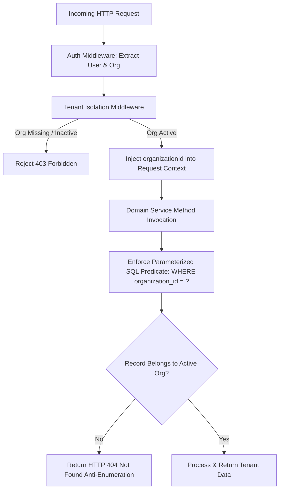

# Multi-Tenant Isolation & BOLA Defense Architecture

**Application:** Digital Impersonation Response Desk  
**Baseline Release:** `v1.0.0-controlled-pilot-rc2`  

---

## 1. Threat Profile: Broken Object-Level Authorization (BOLA / IDOR)

In multi-tenant SaaS platforms, the most prevalent and critical vulnerability is **Broken Object-Level Authorization (BOLA / IDOR)**:
* Operator in Organization A replaces an ID parameter in a URL (e.g. `GET /api/cases/case_zenith_001`) with an ID belonging to Organization B.
* If authorization checks only confirm that the user is logged in—without scoping to their active organization—sensitive cross-tenant data is leaked.

In a cyber impersonation and brand protection system, cross-tenant leakage could expose ongoing confidential investigations, brand vulnerability assessments, and private victim identities.

---

## 2. Multi-Tiered Isolation Architecture



### 2.1 Layer 1: Context Binding (`src/middleware/tenant.ts`)
* The authenticated session token binds the operator to an active `organizationId`.
* Tenant middleware guarantees that all requests have an unambiguous tenant context.
* If a user belongs to multiple organizations, they must explicitly switch organization context; concurrent cross-tenant queries within a single request context are rejected.

### 2.2 Layer 2: Mandatory SQL Parameterization
Every database access layer in the application adheres to strict tenant filtering. Queries never rely on route-level checks alone:
```typescript
// Example from src/services/case-service.ts
const stmt = db.prepare(`
  SELECT * FROM cases 
  WHERE id = ? AND organization_id = ?
`);
const caseRecord = stmt.get(caseId, context.organizationId);

if (!caseRecord) {
  // Return 404 rather than 403 to prevent ID existence enumeration
  throw new NotFoundError('Case not found');
}
```

### 2.3 Layer 3: Anti-Enumeration (404 vs 403)
* When an operator attempts to access a resource that exists in the database but belongs to a different organization, the system returns **`HTTP 404 Not Found`**, identical to the response for a non-existent ID.
* Returning `403 Forbidden` would confirm to an attacker that the targeted resource ID exists; returning `404` completely denies existence verification.

---

## 3. Cross-Tenant Test Verification

Tenant isolation is verified continuously across our test suites:
* `tests/integration/tenant-isolation.test.ts`:
  - Attempts cross-tenant case read: returns `404 Not Found`.
  - Attempts cross-tenant case update: returns `404 Not Found`.
  - Attempts cross-tenant evidence download token generation: returns `404 Not Found`.
  - Attempts cross-tenant submission listing: returns empty set for unauthorized tenant.
* `tests/security/independent-verification.test.ts`:
  - Executes adversarial cross-tenant header tampering (`x-org-id` spoofing): fails closed.
