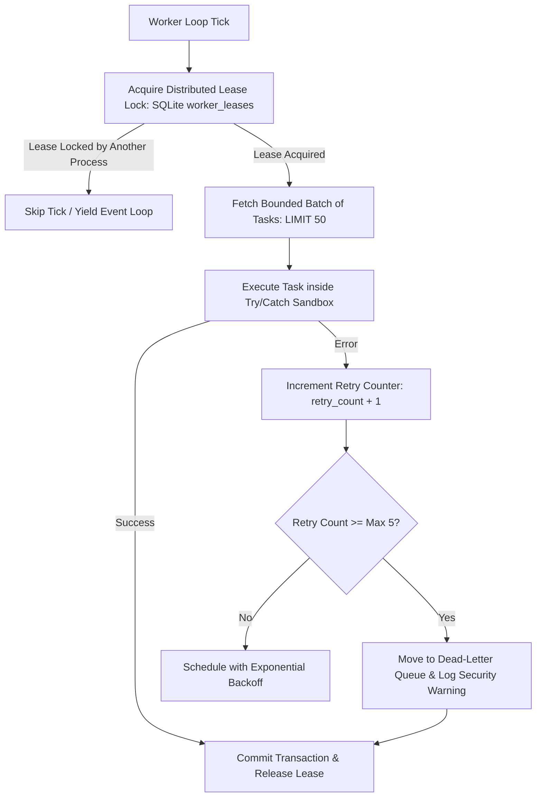

# Background Worker Security & Resilience Architecture

**Application:** Digital Impersonation Response Desk  
**Baseline Release:** `v1.0.0-controlled-pilot-rc2`  

---

## 1. Background Processing Topology

The Response Desk executes high-frequency asynchronous operations: monitoring external signals, scoring threats, auditing evidence checksums, ticking statutory SLA clocks, and aggregating usage metrics.

To prevent background jobs from destabilizing the core API or corrupting state, the system employs **8 isolated workers** coordinated by `src/workers/worker-manager.ts`:

1. `statutory-clock-worker`: Evaluates IT Rules 24h/72h timers.
2. `monitoring-ingestion-worker`: Processes raw external signals.
3. `candidate-scoring-worker`: Runs heuristic threat scoring algorithms.
4. `evidence-integrity-worker`: Computes periodic SHA-256 integrity audits.
5. `provider-sync-worker`: Polls read-only platform grievance status.
6. `webhook-retry-worker`: Retries failed webhook processing with exponential backoff.
7. `retention-worker`: Enforces 180-day WORM retention rules and two-person deletion queues.
8. `usage-rollup-worker`: Aggregates hourly tenant billing and quota meters.

---

## 2. Worker Security & Isolation Controls

### 2.1 Distributed Lease Locking
* Multiple worker processes or horizontal replicas are prevented from executing duplicate or conflicting mutations using database-backed leases (`worker_leases` table).
* Each lease record contains: `worker_name`, `instance_id`, `acquired_at`, and `lease_expires_at`.
* If a worker crashes mid-task, its lease expires after **60 seconds**, allowing another healthy worker instance to resume processing without deadlocks.

### 2.2 Bounded Retries & Dead-Letter Isolation
* Unhandled errors in a task (e.g. malformed webhook payload or transient network failure) cannot cause infinite processing loops.
* Tasks are capped at a maximum of **5 retries** (`MAX_WORKER_RETRIES = 5`) with exponential backoff ($2^n \times 1000\text{ms}$).
* Upon exhausting 5 attempts, the task transitions to a `failed_permanent` dead-letter state, and an administrative alert is emitted to the audit ledger.

### 2.3 Graceful Shutdown & Drain Protection
* All workers register process lifecycle hooks for `SIGTERM` and `SIGINT`.
* When a shutdown signal is received:
  1. Worker loops stop accepting new tasks.
  2. Currently running in-flight transactions are allowed **up to 10 seconds** to finish cleanly and commit.
  3. Database connections and open file descriptors are cleanly closed.
  4. The process exits with code 0, preventing half-written database states.

---

## 3. Automated Verification

Worker resilience and failure injection are verified in:
* `tests/integration/worker-lifecycle.test.ts`: Validates worker startup, lease acquisition, and clean shutdown.
* `tests/resilience/failure-injection.test.ts`: Simulates unhandled task exceptions, database lock timeouts, and dead-letter queue routing.
