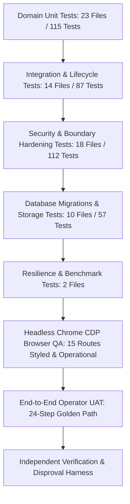

# Testing & Quality Assurance Architecture

**Application:** Digital Impersonation Response Desk  
**Baseline Release:** `v1.0.0-controlled-pilot-rc2`  
**Test Runner:** Vitest v3.0.8  
**Current Test Metrics:** **80 Test Files • 447 Tests Passed • 0 Failures**  

---

## 1. Testing Philosophy & Multi-Tier Strategy

A cybersecurity and evidence preservation platform cannot rely solely on happy-path unit tests. Our testing strategy combines six rigorous verification layers:

---

## 2. Directory Structure & Documentation Guides

* **[Test Strategy & Taxonomy](test-strategy.md):** Complete breakdown of unit, integration, database, and resilience test design.
* **[Security Testing](security-testing.md):** Automated security regression suites, RBAC verification, and fail-closed preflight checks.
* **[Adversarial Testing](adversarial-testing.md):** Red-team negative QA suites defeating 11 targeted exploit attacks.
* **[Browser QA & CDP Automation](browser-qa.md):** Visual styling verification, Tailwind JIT compiler audit, and zero-uncaught-exception assertions.
* **[Operator UAT Report](operator-uat.md):** Human-oriented 24-step golden path operator acceptance testing report across 4 personas.
* **[Comprehensive Verification Matrix](verification-matrix.md):** Authoritative 17-gate verification matrix mapping local capabilities to open external assurance blockers.
